# Azure MySQL Flexible Server 8.0 → 8.4 Data-in Replication 마이그레이션 가이드

> Azure Database for MySQL Flexible Server **8.0 (BLUE)** 에서 **8.4 (GREEN)** 로
> **Data-in Replication** 을 이용해 near-zero downtime 으로 전환하는 step-by-step 가이드입니다.
> BLUE 의 Read Replica 를 유지한 채 GREEN 을 별도로 띄우고, CDC 로 실시간 동기화한 다음
> cutover 시점에만 짧은 다운타임으로 전환합니다.

---

## 환경

```
[현재 BLUE]                                  [신규 GREEN]
8.0 Primary (HA: ZoneRedundant)              8.4 Primary (HA: ZoneRedundant)
 └── 8.0 Read Replica #1                      ├── 8.4 Read Replica #1
 └── 8.0 Read Replica #2                      └── 8.4 Read Replica #2
```

- **점프 박스**: `VM-LINUX-001` (Ubuntu, `/data` 마운트, `mysqlsh 8.4.x` / `az` / `openssl` / `jq` 설치)
- **BLUE**: `my-blue-001.mysql.database.azure.com` — 운영 중, 8.0
- **GREEN**: `my-green-001.mysql.database.azure.com` — 신규, 8.4
- **관리자**: 본 가이드에서는 `<admin-user>` / `<password>` 로 표기 (실제 환경에서는 `sqladmin` 으로 설정되어 있음)
- **Replication 계정**: `syncuser`@`%` (MS 공식 예시명 그대로 사용)

> 본문 코드 블록은 모두 `<admin-user>`, `<blue-fqdn>`, `<password>` 같은 **placeholder** 로 작성합니다.
> 가이드를 수행할 때는 placeholder 를 **본인 환경의 실제 값** 으로 치환해 실행하세요.
> 첨부된 캡처는 본 가이드 작성 당시 환경의 실제 값이 노출되어 있으니, 형식·위치 참고용으로만 보시면 됩니다.

### Data-in / Data-out 관점

BLUE 와 GREEN 이 **둘 다 Azure Database for MySQL Flexible Server** 이므로, 같은 binlog/GTID 복제 흐름을 두 관점에서 볼 수 있습니다:

```
BLUE 8.0  ──binlog / GTID──▶  GREEN 8.4
  Data-out 관점                Data-in 관점
  (source / primary)              (replica / target)
```

Microsoft 문서는 [Data-in Replication](https://learn.microsoft.com/en-us/azure/mysql/flexible-server/how-to-data-in-replication?tabs=bash%2Ccommand-line) 과 [Data-out Replication](https://learn.microsoft.com/en-us/azure/mysql/flexible-server/how-to-data-out-replication?tabs=command-line) 을 별도 가이드로 제공하지만, 두 기능이 서로 독립된 별개 복제 방식이 아니라 **같은 MySQL native replication 을 Azure 서버가 source 인지 target 인지에 따라 나눠 설명** 한 것입니다. 따라서 본 가이드의 운영 절차는 **Data-in 문서 기준으로 수행** (`mysql.az_replication_change_master_with_gtid`, `az_replication_start`, `SHOW REPLICA STATUS` 등 모두 GREEN 에서 실행) 하되, **BLUE 의 source-side 제약 은 Data-out 문서도 함께 검토** 합니다 — 대표적으로:

- BLUE binlog 보존 (`binlog_expire_logs_seconds`) — Step 2
- BLUE 의 Microsoft Entra authentication 관련 제약 — 아래 [Microsoft Entra authentication 사용 시 주의](#microsoft-entra-authentication-사용-시-주의)
- `mysql.__%` 등 Azure 내부 테이블 필터 (`replicate_wild_ignore_table`) — Step 14

---

## 전체 흐름

| Step | 작업 | 실행 위치 |
|---|---|---|
| 1  | BLUE 호환성 검사 (Upgrade Checker) | 💻VM → 🟦BLUE |
| 2  | BLUE 서버 파라미터 확인 | 🟦BLUE |
| 3  | BLUE DEFINER 점검 | 🟦BLUE |
| 4  | BLUE Replication 계정 생성 | 🟦BLUE |
| 5  | GREEN 8.4 Primary 프로비저닝 | 💻VM → ☁️Azure |
| 6  | GREEN 서버 파라미터 검증 | 🟩GREEN |
| 7  | `util.dumpInstance` (BLUE → 파일) | 💻VM → 🟦BLUE |
| 8  | dump GTID 추출 | 💻VM |
| 9  | `util.loadDump` (파일 → GREEN) | 💻VM → 🟩GREEN |
| 10 | GREEN GTID 상태 확인 | 🟩GREEN |
| 11 | GTID reset 사전 점검 | 💻VM → ☁️Azure |
| 12 | GTID reset 실행 | 💻VM → ☁️Azure |
| 13 | BLUE TLS root CA bundle 준비 (DigiCert G2 + Microsoft RSA Root CA 2017) | 💻VM |
| 14 | change master + start replication | 💻VM → 🟩GREEN |
| 15 | REPLICA STATUS 검증 + 동작 검증 | 🟩GREEN (+🟦BLUE) |
| 16 | GREEN Read Replica 2개 생성 | 💻VM → ☁️Azure |
| 17 | 정합성 검증 (row count / checksum) | 🟦BLUE + 🟩GREEN |
| 18 | Cutover — write freeze | App / ☁️Azure |
| 19 | Cutover — lag=0 확인 + 복제 끊기 | 🟩GREEN |
| 20 | Application 전환 + 사후 정리 | App / ☁️Azure |

---

## ⚠️ 시작 전 반드시 알아야 할 제약

| 제약 | 이유 | 대응 |
|---|---|---|
| GREEN 에 Read Replica 가 있으면 GTID reset 실패 (`GtidResetServerHasReadReplica`) | Azure 제약 | **Step 12 (GTID reset) 까지 GREEN Replica 0개 유지** — Step 16 에서 생성 |
| GREEN 의 Geo-redundant backup 이 Enabled 면 GTID reset 거부 | Azure 제약 | **Step 5 에서 `--geo-redundant-backup Disabled` 로 생성** (본 환경 BLUE/GREEN 둘 다 Disabled) |
| Azure Flex 의 admin은 `SUPER` / `CONNECTION_ADMIN` 없음 | PaaS 보안 모델 | `loadDump` 시 `--updateGtidSet=off`, `super_read_only` 변경 불가 (8.0/8.4 동일, `read_only` 사용) |
| BLUE/GREEN `lower_case_table_names` 는 반드시 동일 | 서버 생성 후 변경 불가 | Step 5 에서 BLUE 와 동일 값으로 생성 (Azure Flex 허용값: 1 또는 2, 기본 = 1) |
| `mysql.az_replication_*` 프로시저는 Azure 전용 | 표준 `CHANGE REPLICATION SOURCE` 사용 불가 | 본 가이드의 wrapper 그대로 사용 |
| BLUE 가 Azure Flex 면 **Data-out** 제약 적용 | Microsoft Entra authentication 구성 서버의 Data-out 은 공식적으로 지원되지 않으며, source 에서 Entra user create/update 가 발생하면 replication 이 중단될 수 있음 | 본 환경 (BLUE/GREEN 모두 MySQL + Entra 혼합 인증) 에서 일반 데이터 복제는 리허설로 정상 동작 확인. 단 **CDC 기간 중 Entra 관련 변경 은 freeze**, GREEN/Replica 는 자체적으로 같은 identity · Entra admin 구성. 상세 → [Microsoft Entra authentication 사용 시 주의](#microsoft-entra-authentication-사용-시-주의). (참고: 내부 테이블 필터 `replicate_wild_ignore_table` 은 본 환경에서 GREEN 의 값이 `mysql.%,information_schema.%,performance_schema.%,sys.%` 로 이미 설정되어 있음을 확인 — 단 공식 Data-out 문서의 요구사항은 replica 에 `Replicate_Wild_Ignore_Table = "mysql.__%"` 필터 적용이므로, 운영 전에는 Step 14 의 확인 절차를 따르세요) |

---

## Microsoft Entra authentication 사용 시 주의

BLUE 와 GREEN 이 **모두 Azure Flexible Server** 이고 Authentication method 가 `MySQL and Microsoft Entra authentication` 으로 구성되어 있는 환경에서의 주의사항입니다.

### 본 환경에서 검증된 항목

- BLUE → GREEN GTID Data-in Replication 정상 시작
- 일반 application schema/table 의 DML 복제 정상
- GREEN Read Replica 까지 데이터 전파 정상

### 공식 문서상 제약

Microsoft 공식 Data-out Replication 문서는 **Azure authentication 이 구성된 Azure Database for MySQL Flexible Server 의 Data-out Replication 은 지원되지 않음** 으로 명시하고 있으며, source 서버에서 Microsoft Entra user create/update transaction 이 발생하면 Data-out Replication 이 중단될 수 있다고 설명합니다. 본 환경은 이 supportability 제약이 적용되는 구성이므로, 일반 데이터 복제가 동작하더라도 아래 운영 제약을 따릅니다.

### CDC 기간 중 금지 작업 (BLUE)

- Microsoft Entra admin 변경
- Authentication method 변경
- User Assigned Managed Identity 변경
- Microsoft Entra user CREATE / UPDATE / DROP
- Entra 관련 권한 / 계정 변경 테스트

이 작업들은 BLUE 의 binlog 에 기록되어서는 안 되는 종류의 트랜잭션이므로, cutover 완료 전까지 자제합니다.

### GREEN / GREEN Read Replica 의 Entra 구성

Microsoft Entra authentication 은 **복제로 동기화되지 않습니다** (Data-in/Data-out 문서 공통). GREEN Primary 와 GREEN Read Replica 에 다음을 **별도로 같게 구성** 해야 합니다:

- User Assigned Managed Identity
- Microsoft Entra Admin (같은 Entra user / group / application)
- 앱에서 쓰는 Entra 계정/구성원 및 해당 계정의 database 권한

### cutover 전 로그인 검증 체크리스트 (GREEN)

- MySQL native 계정 로그인
- Microsoft Entra admin 로그인
- Application Entra 계정 로그인
- GREEN Read Replica 에서 필요한 Entra 로그인
- Entra 계정의 database 권한 정상 동작

---

# Step 1. BLUE 호환성 검사 (Upgrade Checker)

> **목적**: BLUE 8.0 의 시스템 변수 / 계정 / 객체 중 **8.4 에서 제거/변경되는 항목** 을 사전에 검출해 마이그레이션 차단 요소를 제거합니다.  
> **실행 위치**: 💻VM → 🟦BLUE

> 💡 **점프박스 사전 도구 (Ubuntu 기준)** — 본 가이드 전체에서 다음 도구를 사용합니다.
>
> | 도구 | 용도 | 사용 Step |
> |---|---|---|
> | `mysqlsh` (MySQL Shell) **8.0.32+** (8.4 LTS 권장) | upgrade checker / dump / load / replication 제어 | 1, 7, 9, 14 |
> | `mysql-client` | 임시 sql 점검 | 보조 |
> | `az` (Azure CLI) | 서버 파라미터 / GTID reset / replica 생성 | 2.1.1, 5, 11, 12, 16, 18, 20 |
> | `jq` | checker / dump 메타데이터 JSON 파싱 | 1, 8 |
> | `curl`, `openssl` | CA PEM 다운로드 / fingerprint 및 TLS 검증 | 13 |
>
> `curl` / `openssl` 은 Ubuntu 기본 포함. 나머지 설치 예시:
> ```bash
> # MySQL Shell + client
> wget https://dev.mysql.com/get/mysql-apt-config_0.8.32-1_all.deb
> sudo DEBIAN_FRONTEND=noninteractive dpkg -i mysql-apt-config_*.deb
> sudo apt-get update
> sudo apt-get install -y mysql-shell mysql-client jq
>
> # Azure CLI (Microsoft 공식 스크립트)
> curl -sL https://aka.ms/InstallAzureCLIDeb | sudo bash
>
> # 버전 확인
> mysqlsh --version    # 8.4.x
> az version
> jq --version
> ```
>
> 설치 후 `az login` (또는 점프박스에 부여된 Managed Identity) 으로 Azure 인증을 마쳐두세요.

## 1.1 실행

```bash
mysqlsh <admin-user>@<blue-fqdn>:3306 --ssl-mode=REQUIRED --password \
  -- util check-for-server-upgrade \
     --target-version=8.4.0 \
     --output-format=JSON \
  > ~/upgrade_check_8.4.json 2> ~/upgrade_check_8.4.err
echo "exit=$?"
```

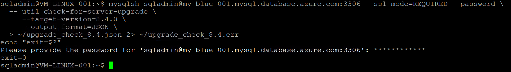

## 1.2 결과 검증

```bash
# 문제가 있는 점검만 추출
jq '.checksPerformed[] | select(.detectedProblems | length > 0)' ~/upgrade_check_8.4.json

# Error 레벨만
jq '[.checksPerformed[] | .detectedProblems[]? | select(.level=="Error")]' ~/upgrade_check_8.4.json
```

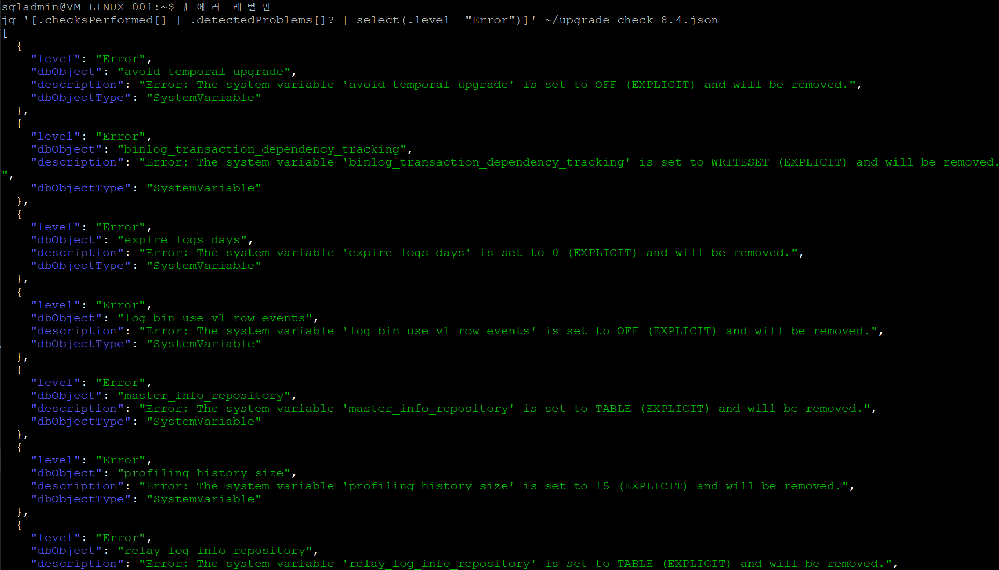

검출된 문제는 3가지로 분류:
| 분류 | 처리 | 참조 |
|---|---|---|
| Azure PaaS 노이즈 (제거된 sysvar, `azure_superuser` 관련 등) | **무시** | [docs/azure_flex_allowlist.md](docs/azure_flex_allowlist.md) |
| 조건부 (`ssl_cipher`, `mysql_native_password` 계정 등) | **조건 확인 후 무시** | [docs/azure_flex_allowlist.md](docs/azure_flex_allowlist.md), [docs/authentication_plugins.md](docs/authentication_plugins.md) |
| Error (앱 계정 / 객체 DEFINER 등) | **수정 필요** | [docs/definer_handling.md](docs/definer_handling.md) |

---

# Step 2. BLUE 서버 파라미터 확인

> **목적**: Data-in Replication 이 정상 동작하고 BLUE/GREEN 간 데이터 의미가 변형되지 않도록, **필수 파라미터들이 요구 조건을 충족하는지** 점검합니다.  
> **실행 위치**: 🟦BLUE

SQL 클라이언트 (mysqlsh / mysql CLI / DBeaver / MySQL Workbench 등 무엇이든 가능) 로 접속 후:

```sql
SHOW VARIABLES WHERE Variable_name IN (
  'version',
  'server_id',
  'server_uuid',
  'gtid_mode',
  'enforce_gtid_consistency',
  'binlog_format',
  'binlog_row_image',
  'log_bin',
  'lower_case_table_names',
  'binlog_expire_logs_seconds',
  'character_set_server',
  'collation_server',
  'time_zone',
  'transaction_isolation',
  'innodb_strict_mode',
  'sql_mode',
  'default_authentication_plugin'
);
```

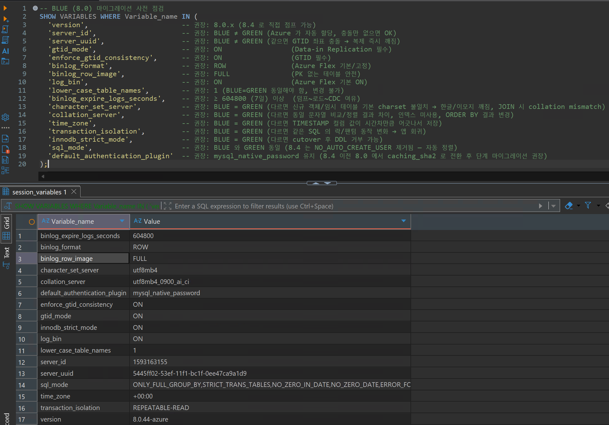

각 파라미터의 **통과 조건 / 의미 / 미통과 시 대응** 은 → [docs/parameter_compatibility.md](docs/parameter_compatibility.md)

## 2.1 BLUE 필수값 점검

다음 값은 **dump 전에 반드시 충족** 해야 합니다.

| 변수 | 필수값 | Azure Flex 기본 | 어긋났을 때 |
|---|---|---|---|
| `gtid_mode` | `ON` | `ON` | Step 8 에서 dump GTID 가 비어 나옴 → replication 불가 |
| `enforce_gtid_consistency` | `ON` | `ON` | non-transactional DDL 로 GTID 좌표 오염 |
| `binlog_format` | `ROW` | `ROW` (변경 불가) | statement 기반 차이로 데이터 불일치 |
| `binlog_row_image` | `FULL` | `FULL` | 전 컬럼 이미지를 잡으므로 row-based replication 안전성 증가. 단 PK 없는 InnoDB 테이블은 [docs/parameter_compatibility.md §2.6](docs/parameter_compatibility.md) 경고 참조 |
| `log_bin` | `ON` | `ON` (변경 불가) | binlog 자체 없음 → replication 불가 |
| `binlog_expire_logs_seconds` | **`604800` (7일) 이상** | `0` (기본값 — 무제한 아님. handle 이 free 되는 즉시 삭제 가능) | dump→load 중 binlog purge → `ERROR 1236` |
| `lower_case_table_names` | BLUE 와 동일 | `1` | Step 5 에서 GREEN 도 동일 값으로 생성. **이후 변경 불가** |
| `character_set_server` / `collation_server` | BLUE 와 동일 | 보통 `utf8mb4` / `utf8mb4_0900_ai_ci` | Step 5 이후 GREEN 에 맞춤 |
| `time_zone` | BLUE 와 동일 | `+00:00` | TIMESTAMP 컬럼 시간차 발생 |
| `sql_mode` / `transaction_isolation` / `innodb_strict_mode` | BLUE 와 동일 | 환경별 | 쿼리/DDL 동작 차이로 cutover 후 회귀 |

### 2.1.1 `binlog_expire_logs_seconds` 상향 (미설정 경우)

```bash
az mysql flexible-server parameter set \
  -g <resource-group> -s <blue-name> \
  --name binlog_expire_logs_seconds --value 604800
```

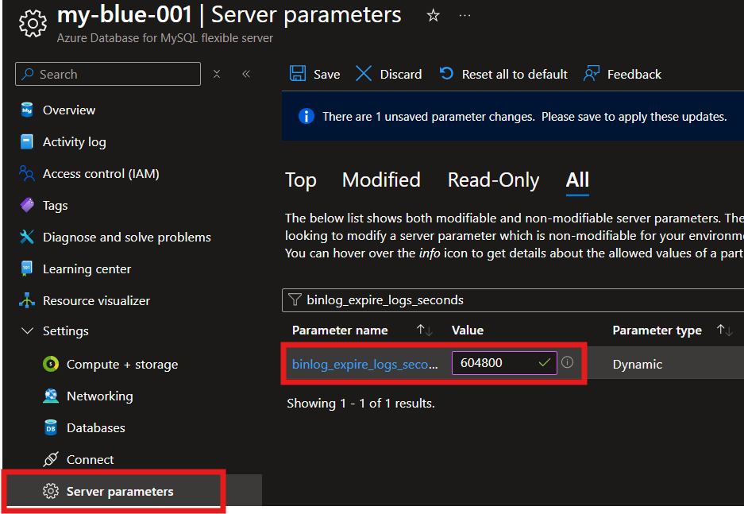

> 다른 항목이 어긋났다면 [docs/parameter_compatibility.md](docs/parameter_compatibility.md) §2 의 대응 방법을 참조하세요.

---

# Step 3. BLUE DEFINER 점검

> **목적**: routine / trigger / view / event 의 DEFINER 계정이 GREEN 에서도 유효하게 만들어 cutover 후 `ERROR 1449` 를 예방합니다.  
> **실행 위치**: 🟦BLUE

MySQL 의 routine / trigger / view / event 는 정의 시점의 `DEFINER` 계정 권한으로 실행됩니다. 이 DEFINER 계정이 GREEN 에 존재하지 않으면 cutover 후 해당 객체를 호출하는 순간 `ERROR 1449: The user specified as a definer ... does not exist` 가 발생합니다.

본 가이드에서 GREEN 에 계정이 만들어지는 유일한 경로는 **Step 7 dump 의 `--includeUsers` 화이트리스트 + Step 9 load 의 `--loadUsers=true`** 입니다. 이 화이트리스트에 포함되지 않은 DEFINER 계정은 cutover 후 GREEN 에 누락된 상태로 남게 되므로, dump 전에 모든 DEFINER 가 아래 어느 분류인지 파악하고, cutover 전에 **GREEN `mysql.user` 에서 실제 존재 + 필요한 권한 보유** 까지 확인해야 합니다:

- ✅ **앱 / 관리 계정** (`<admin-user>@%` 등 — Step 7 dump 의 `--includeUsers` 대상이거나 GREEN 에 이미 존재) → dump/load 로 적재되거나 이미 있음. cutover 전에 `mysql.user` 에서 실재 확인
- ⚠️ **이미 삭제된 계정 / 특정 host 로 고정된 계정** (예: `oldadmin@10.0.0.5`) → BLUE 에서 미리 재정의 (host 를 `%` 등으로) 후 dump 재수행
- ⚠️ **`--includeUsers` 화이트리스트에 없는 계정** 이 DEFINER 인 경우 → 해당 계정을 `--includeUsers` 목록에 추가하거나, BLUE 에 이미 존재하는 다른 운영 계정으로 재정의

> ⚠️ DEFINER 패턴을 REGEXP 로 필터링하면 **위험한 DEFINER 를 놓칠 수 있음**.
> **모든 사용자 객체를 출력**하고 `definer` 컬럼을 눈으로 판정합니다.

```sql
SELECT 'ROUTINE' AS kind, 
		routine_schema AS db, 
		routine_name AS name, 
		definer
FROM information_schema.routines
WHERE routine_schema NOT IN ('mysql','sys','performance_schema','information_schema')
UNION ALL
SELECT 'TRIGGER' AS kind,
		trigger_schema AS db, 
		trigger_name AS name, 
		definer
FROM information_schema.triggers
WHERE trigger_schema NOT IN ('mysql','sys','performance_schema','information_schema')
UNION ALL
SELECT 'VIEW' AS kind, 
		table_schema AS db, 
		table_name AS name, 
		definer
FROM information_schema.views
WHERE table_schema NOT IN ('mysql','sys','performance_schema','information_schema')
UNION ALL
SELECT 'EVENT' AS kind,
		event_schema AS db, 
		event_name AS name, 
		definer
FROM information_schema.events
WHERE event_schema NOT IN ('mysql','sys','performance_schema','information_schema')
ORDER BY kind, db, name;
```

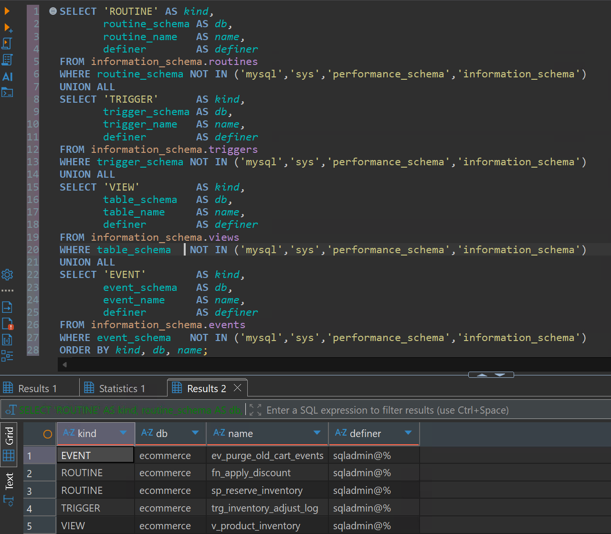

판정 표 / 재정의 레시피 / `ERROR 1449` 시나리오 → [docs/definer_handling.md](docs/definer_handling.md)

---

# Step 4. BLUE Replication 계정 생성

> **목적**: GREEN 이 BLUE 의 binlog 를 끌어올 때 사용할 **최소 권한 전용 계정** 을 BLUE 에 만듭니다. 이 계정이 GREEN 의 `CHANGE REPLICATION SOURCE` 자격으로 사용됩니다.  
> **실행 위치**: 🟦BLUE

MS 공식 문서: [Configure Data-in Replication](https://learn.microsoft.com/en-us/azure/mysql/flexible-server/how-to-data-in-replication?tabs=bash%2Ccommand-line) 기준 최소 권한.

```sql
CREATE USER 'syncuser'@'%' IDENTIFIED BY '<password>' REQUIRE SSL;
GRANT REPLICATION SLAVE ON *.* TO 'syncuser'@'%';

-- 검증
SELECT user, host, plugin, ssl_type
FROM mysql.user
WHERE user = 'syncuser';
```

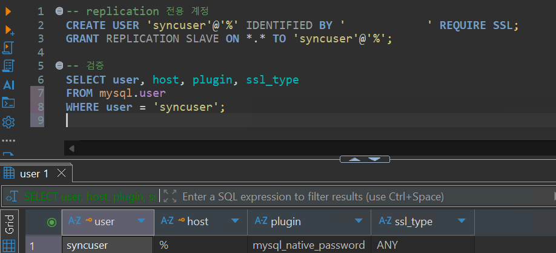

> - `REPLICATION SLAVE` 하나면 binlog 읽기에 충분
> - `REQUIRE SSL` 은 MS 권장
> - `ssl_type` 컬럼이 `ANY` 로 보이면 정상

---

# Step 5. GREEN 8.4 Primary 프로비저닝

> **목적**: 마이그레이션 대상이 될 GREEN 8.4 Primary 서버를 **이후 GTID reset 이 허용되는 조건** (Geo backup Disabled, Read Replica 0개) 으로 새로 생성합니다. `lower_case_table_names` 처럼 생성 후 바꿀 수 없는 파라미터도 이 시점에 확정됩니다.  
> **실행 위치**: 💻VM → ☁️Azure

Step 12 의 `az mysql flexible-server gtid reset` 명령은 다음 두 조건이 충족되지 않으면 **거부** 됩니다 (Azure PaaS 제약):

1. **GREEN 에 Read Replica 가 0개** — 하나라도 있으면 `GtidResetServerHasReadReplica` 에러
2. **Geo-redundant backup = Disabled** — Enabled 면 `Cannot reset GTID set because geo-redundant backup is enabled`

그래서 GREEN 은 처음부터 Replica 없이 / Geo Disabled 로 만듭니다. 잘못 만들었을 때 대응:

- Read Replica 는 삭제로 해소 가능 (시간 소요, Step 16 에서 재생성)
- **HA = ZoneRedundant 서버의 Geo-redundant backup 은 생성 후 토글 불가** (Azure portal 안내 문구: *"Enabling/Disabling Geo-redundancy post server creation is currently not supported for servers with zone-redundant storage."*) → **서버 재생성** 만이 유일한 경로

또한 `lower_case_table_names` 는 서버 생성 후 **변경 불가** 이므로 BLUE 와 동일한 값으로 맞추어야 합니다.

## 5.1 BLUE `lower_case_table_names` 값 확인 (GREEN 생성 전)

🟦 [BLUE] 에서:

```sql
SHOW VARIABLES LIKE 'lower_case_table_names';
-- Azure Database for MySQL Flexible Server 기본 = 1 (Portal / CLI 로 생성 시 default)
```

Azure Database for MySQL Flexible Server 에서 `lower_case_table_names` 는 **`1` (default) 또는 `2`** 를 허용됩니다. 이 값은 서버 생성 시점에 결정되며 생성 후 변경 불가, BLUE 와 동일한 값으로 GREEN 을 생성해야 합니다.

- **BLUE = `1`** → GREEN default 와 동일. 5.2 의 `az flexible-server create` 를 그대로 실행
- **BLUE = `2`** → GREEN 생성 시점에 `2` 로 지정 필요. `az flexible-server create` 에는 이 값을 지정하는 인자가 없으므로 Portal 의 **Additional configuration** 또는 IaC (Bicep/ARM/Terraform) 로 생성 시점에 고정

## 5.2 GREEN 생성

```bash
LOC=koreacentral

az mysql flexible-server create \
  --resource-group <resource-group> \
  --name <green-name> \
  --location $LOC \
  --version 8.4 \
  --sku-name Standard_D4ds_v4 \
  --tier GeneralPurpose \
  --storage-size 128 --storage-auto-grow Enabled \
  --high-availability ZoneRedundant \
  --admin-user <admin-user> --admin-password <password> \
  --backup-retention 7 --geo-redundant-backup Disabled
```

> ⚠️ **Read Replica 는 만들지 말 것** — Step 12 의 `gtid reset` 이 거부됩니다.  
> ⚠️ **Geo-redundancy 는 Disabled** — `gtid reset` prerequisite. 본 환경은 BLUE/GREEN 모두 Disabled 로 유지.  
> ⚠️ `lower_case_table_names` 가 BLUE 와 동일해야 함 (Azure Flex 허용값: 1 또는 2, 기본 = 1, **생성 후 변경 불가**).  
> ⚠️ HA = ZoneRedundant 는 그대로 둔 채 GTID reset 가능 (HA 자체는 reset 을 막지 않음. Geo backup 만 막음).

## 5.3 GREEN `lower_case_table_names` 사후 확인 (load 전 필수)

🟩 [GREEN] 에서:

```sql
SHOW VARIABLES LIKE 'lower_case_table_names';
```

- **BLUE 와 동일** → Step 6 진행
- **다름** → load (Step 9) 진행 금지. `lower_case_table_names` 는 서버 초기화 후 변경 불가이므로 **GREEN 을 삭제하고 재생성**해야 합니다. 재생성 시에는 Portal Additional Configuration 또는 IaC (Bicep/ARM/Terraform) 에서 이 값을 생성 시점부터 원하는 값으로 고정할 수 있는지 사전 확인합니다.

---

# Step 6. GREEN 서버 파라미터 검증

> **목적**: GREEN 이 BLUE 와 동일한 의미론으로 동작하는지 (`lower_case_table_names`, charset, time_zone, sql_mode 등) 확인하고, 8.4 신규 항목 (`authentication_policy`) 을 점검합니다. 차이가 있으면 dump 이전에 GREEN 파라미터를 맞춥니다.  
> **실행 위치**: 🟩GREEN

```sql
SHOW VARIABLES WHERE Variable_name IN (
  'version',
  'server_id',
  'server_uuid',
  'gtid_mode',
  'enforce_gtid_consistency',
  'binlog_format',
  'binlog_row_image',
  'log_bin',
  'lower_case_table_names',
  'binlog_expire_logs_seconds',
  'local_infile',
  'event_scheduler',
  'character_set_server',
  'collation_server',
  'time_zone',
  'transaction_isolation',
  'innodb_strict_mode',
  'sql_mode',
  'authentication_policy'
);

-- 8.4 에서 mysql_native_password plugin 활성 상태 확인
SELECT plugin_name, plugin_status, plugin_type, plugin_library
  FROM information_schema.plugins
 WHERE plugin_name = 'mysql_native_password';
-- BLUE 에서 dump/load 할 계정 중 mysql_native_password 사용 계정이 있으면 plugin_status = 'ACTIVE' 필요
-- 모든 계정이 caching_sha2_password 이면 ACTIVE 필수 아님
```

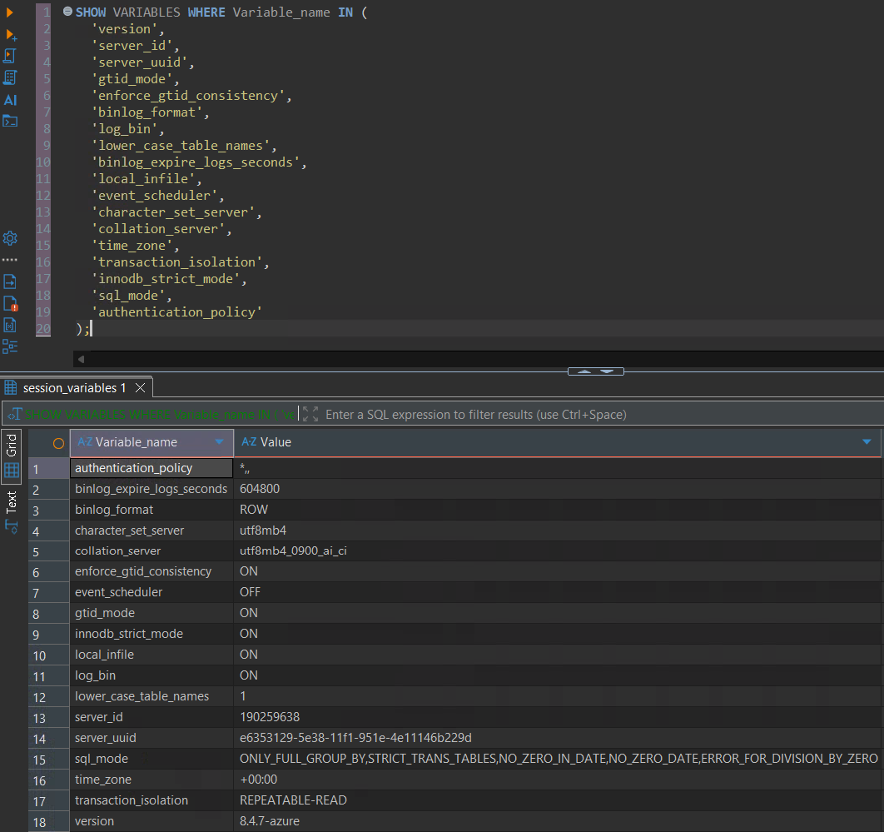

기대값 요약:
- **고정/필수**: `gtid_mode=ON`, `enforce_gtid_consistency=ON`, `binlog_format=ROW`, `binlog_row_image=FULL`, `log_bin=ON`
- **BLUE 와 일치 필수**: `lower_case_table_names`, `character_set_server`, `collation_server`, `time_zone`, `transaction_isolation`, `innodb_strict_mode`, `sql_mode`
- **로드용 임시 설정**: `event_scheduler=OFF` (cutover 시 ON 으로)
- **server_uuid**: BLUE 와 절대 같으면 안 됨
- **mysql_native_password plugin**:
  - BLUE 에서 dump/load 할 앱 계정 중 `mysql_native_password` 를 사용하는 계정이 하나라도 있으면 GREEN 에서 `ACTIVE` 필요
  - 모든 앱/운영 계정이 `caching_sha2_password` 로 전환되어 있다면 `ACTIVE` 가 필수는 아님 (`DISABLED` 여도 무방)

상세 → [docs/parameter_compatibility.md](docs/parameter_compatibility.md), [docs/authentication_plugins.md](docs/authentication_plugins.md)

---

# Step 7. `util.dumpInstance` (BLUE → 파일)

> **목적**: BLUE 의 스키마 / 데이터 / 선택된 사용자 / routine / trigger / event 를 **consistent 스냅샷** 으로 점프박스의 `/data` 에 덤프합니다. dump 에는 해당 시점의 GTID 좌표가 함께 기록되어 Step 8 에서 추출됩니다.  
> **실행 위치**: 💻VM → 🟦BLUE

> 🔀 **대안 경로 안내**: 이 Step 7~12 는 **dump/load 기반 시딩** 경로입니다. BLUE Read Replica 를 8.4 로 in-place 업그레이드 한 뒤 promote 해서 GREEN 을 구성하는 **물리 시딩 대안** 은 → [docs/seed_via_replica_promotion.md](docs/seed_via_replica_promotion.md). 둘 중 한 경로만 수행하면 되며, 대안 경로를 택하면 Step 7~12 를 그 문서 절차로 대체하고 나머지(Step 1~6, 13~20)는 동일하게 따릅니다.

## 7.1 dump 디렉토리 준비

```bash
DUMPDIR=/data/dump_blue
df -h /data           # 데이터 디스크 마운트 확인
rm -rf $DUMPDIR
mkdir -p $DUMPDIR
ls -la $DUMPDIR       # . 과 .. 만 보여야 OK
```

## 7.2 dump 실행

> ⚠️ 사용자 계정은 `--includeUsers` 화이트리스트에 **명시한 계정만** dump 대상으로 삼습니다. "빌트인/관리자 계정은 자동 제외된다" 는 동작에 의존하지 말고, 완료 후 dump 로그의 `M users will be dumped` 가 기대 계정 수와 일치하는지 + load dry-run 으로 관리자/내부 계정이 섞여 있지 않은지 확인하세요.  
> 💡 아래 예시는 본 환경에서 검증된 형식입니다 (`--includeUsers="user@%"`). MySQL Shell 공식 문서는 user account 문자열을 `'user_name'@'host_name'` 형태로 명시하길 권장하므로, 환경에 따라 `--includeUsers="'app_user_1'@'%'"` 처럼 더 엄격한 quote 형식 을 쓰면 user/host 파싱 모호성을 줄일 수 있습니다.

```bash
mysqlsh --uri <admin-user>@<blue-fqdn>:3306 \
  --ssl-mode=REQUIRED --password \
  -- util dump-instance "/data/dump_blue" \
  --threads=8 \
  --bytesPerChunk=256M \
  --compression=zstd \
  --consistent=true \
  --users=true \
  --includeUsers="<app-user-1>@%" \
  --includeUsers="<app-user-2>@%" \
  --includeUsers="<app-user-3>@%" \
  --routines=true \
  --triggers=true \
  --events=true \
  --tzUtc=true \
  --ocimds=false
```

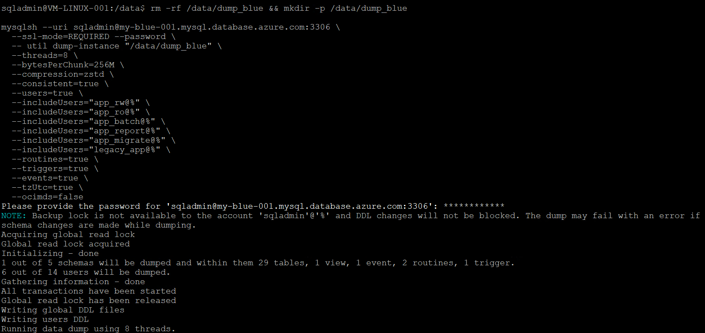

완료 로그에서 다음 라인 확인:
```
X schemas will be dumped and within them N tables, ...routines, ...triggers, ...events
M users will be dumped.
```

> `--includeUsers` 동작 / dump 시 일반적으로 제외되는 계정 카테고리 / `--ocimds=false` 등의 상세 → [docs/authentication_plugins.md](docs/authentication_plugins.md)

---

# Step 8. dump GTID 추출

> **목적**: dump 메타데이터(`@.json`) 에서 **dump 시점의 BLUE `gtid_executed`** 를 추출해 `BLUE_GTID` 환경변수에 저장합니다. 이 값이 Step 12 GTID reset 의 입력값이 됩니다.  
> **실행 위치**: 💻VM

```bash
BLUE_GTID=$(jq -r '.gtidExecuted | gsub("\\n";"")' /data/dump_blue/@.json)
echo "BLUE_GTID=$BLUE_GTID"
# 예) 5445ff02-53ef-11f1-bc1f-0ee47ca9a1d9:1-102
```

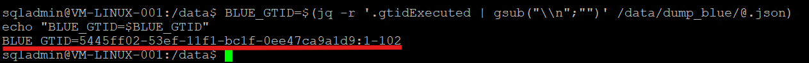

`BLUE_GTID` 가 비어 있으면 다음을 차례로 확인:

1. BLUE `gtid_mode = ON` 인지 (가장 흔한 원인)
2. dump 실행 계정에 `REPLICATION CLIENT` 권한이 있는지 — 없으면 metadata 의 binlog 좌표 자체가 비어 나옴
3. `/data/dump_blue/@.json` 이 정상 생성되었는지 (`gtidExecuted` 필드 존재 여부)
4. dump 가 실제로 consistent snapshot 으로 완료되었는지 (`--consistent=true` 옵션 + 완료 로그의 `Dump duration`/`Total duration` 정상)

위 항목을 보정 후 dump 재실행.

---

# Step 9. `util.loadDump` (파일 → GREEN)

> **목적**: 덤프 파일을 GREEN 에 적재하여 **BLUE dump 시점의 스냅샷과 동일한 상태** 를 GREEN 에 재현합니다. 이후 GTID reset 의 기준점을 깨끗하게 유지하기 위해 Azure Flex 전용 옵션을 함께 사용합니다.  
> **실행 위치**: 💻VM → 🟩GREEN

이 단계에서 두 개의 Azure Flex 관련 옵션이 있습니다:

- **`--updateGtidSet=off`** (필수) — mysqlsh 가 load 끝에 `gtid_purged` 를 직접 갱신하는 동작을 끔. Azure Flex admin 은 `SUPER` 권한이 없으므로 `replace` / `append` 모드는 Access denied 로 실패함. 대신 load 시점에는 off 로 두고, GTID 좌표는 Step 12 의 Azure 전용 `az ... gtid reset` 명령으로 설정합니다.
- **`--skipBinlog=true`** (선택) — `util.loadDump` 가 load 세션에서 `SET sql_log_bin=0` 을 실행하게 함. 이 권한은 Azure Flex admin 에 따라 다르며, **mysqlsh `--dryRun` 은 실제 import 를 수행하지 않고 dump 기반 검증만 돌리므로 sql_log_bin 권한을 보장하지 않습니다**. 사용하려면 아래 "권한 사전 테스트" 를 먼저 수행하세요.

**`--skipBinlog=true` 권한 사전 테스트** (load 전 별도 세션에서):

```sql
SET SESSION sql_log_bin = 0;
SET SESSION sql_log_bin = 1;
```

- 둘 다 성공 → `--skipBinlog=true` 사용 가능
- 하나라도 `Access denied` → `--skipBinlog=true` 미사용. 이 경우 load 중 GREEN UUID 의 GTID 가 생성될 수 있으므로, Step 12 `gtid reset` 이후 반드시 `@@GLOBAL.gtid_purged` / `@@GLOBAL.gtid_executed` 가 `BLUE_GTID` 와 정확히 일치하는지 확인

즉 **Step 9 (load) → Step 10 (gtid 상태 확인) → Step 11 (사전점검) → Step 12 (reset)** 이 한 묶음의 PaaS 우회 절차입니다.

## 9.1 dry-run 검증

```bash
mysqlsh <admin-user>@<green-fqdn>:3306 \
  --ssl-mode=REQUIRED --password \
  -- util load-dump "/data/dump_blue" \
  --dryRun=true \
  --loadUsers=true \
  --ignoreVersion=true
```

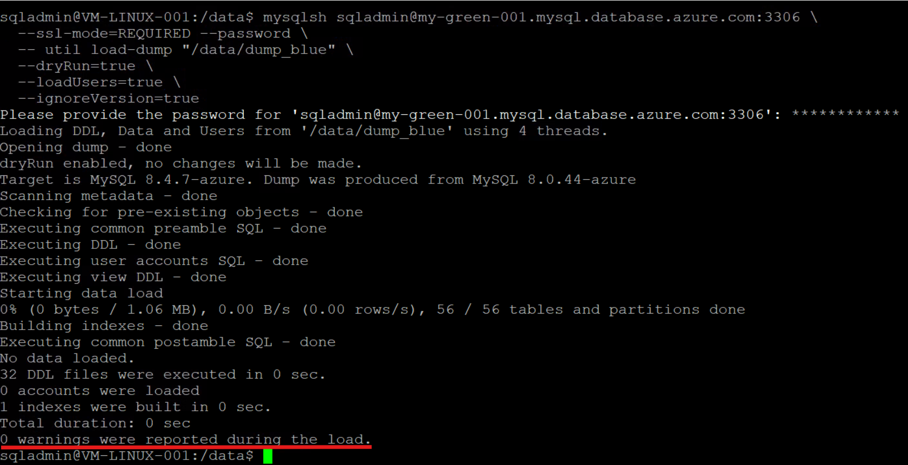

오브젝트/유저 개수가 dump 로그와 일치하는지 확인.

## 9.2 실제 load

```bash
mysqlsh --uri <admin-user>@<green-fqdn>:3306 --ssl-mode=REQUIRED --password \
  -- util load-dump "/data/dump_blue" \
  --threads=16 \
  --backgroundThreads=8 \
  --analyzeTables=on \
  --deferTableIndexes=all \
  --loadUsers=true \
  --updateGtidSet=off \
  --ignoreExistingObjects=false
```

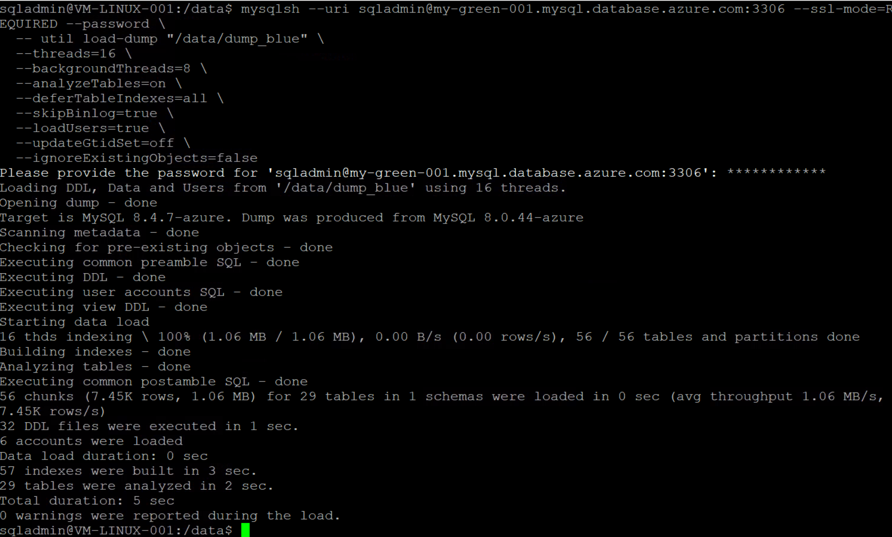

> ⚠️ `--updateGtidSet=off` **필수** — Azure Flex admin 은 `SUPER` 가 없어서 `replace`/`append` 모드는 Access denied 로 실패.  
> 💡 `--skipBinlog=true` 는 권한 환경에서 **선택적으로** 추가. 사용 전 반드시 별도 SQL 세션에서 `SET SESSION sql_log_bin = 0; SET SESSION sql_log_bin = 1;` 을 실행해 권한을 확인하세요 (Step 9 권한 사전 테스트 참고). `Access denied` 가 발생하면 `--skipBinlog=true` 를 사용하지 않습니다. 이 경우 load 중 GREEN UUID 의 GTID 가 생성될 수 있으므로, Step 12 `gtid reset` 이후 `@@GLOBAL.gtid_purged` / `@@GLOBAL.gtid_executed` 가 `BLUE_GTID` 와 정확히 일치하는지 확인하면 결과적으로 동일한 좌표로 정리됩니다.

---

# Step 10. GREEN GTID 상태 확인

> **목적**: load 직후 GREEN 의 `gtid_executed` / `gtid_purged` 가 예상대로 **비어 있거나 GREEN UUID 의 트랜잭션만** 들어 있는지 확인합니다. BLUE UUID 의 GTID 가 보이면 GTID reset 이 실패하거나 의도치 않은 값이 설정될 수 있습니다.  
> **실행 위치**: 🟩GREEN

```sql
SELECT @@GLOBAL.gtid_executed;
-- 비어있거나 GREEN UUID 의 트랜잭션만. BLUE UUID 는 아직 없음.

SELECT @@GLOBAL.gtid_purged;
-- 비어있음 (정상)
```

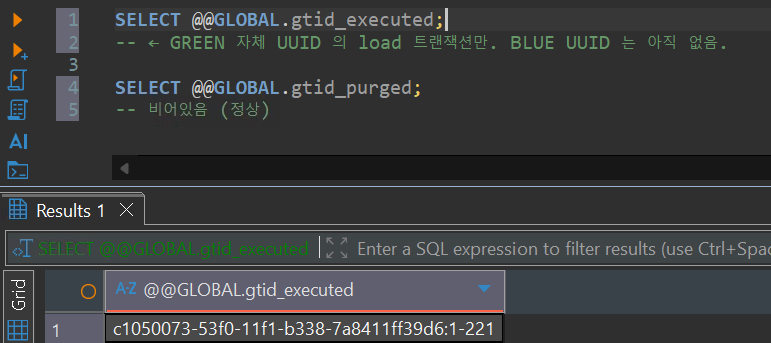

---

# Step 11. GTID reset 사전 점검

> **목적**: Azure Flex 의 GTID reset 이 거부되는 두 가지 조건 (**Read Replica 존재**, **Geo-redundant backup Enabled**) 을 수행 직전에 확인합니다.  
> **실행 위치**: 💻VM → ☁️Azure

Step 5 에서 이미 이 조건으로 GREEN 을 생성했다면 둘 다 몇 초 내 통과해야 정상입니다. 둘 중 하나라도 제대로 나오지 않으면 다음 에러 코드가 Step 12 에서 나오며, 대응책은 아래 [트러블슈팅 빠른 참조](#트러블슈팅-빠른-참조) 에 정리되어 있습니다:

- Replica 가 있으면 → `GtidResetServerHasReadReplica`
- Geo backup 이 Enabled 면 → `Cannot reset GTID set because geo-redundant backup is enabled`

> 💡 HA = ZoneRedundant 자체는 reset 을 막지 않습니다 (주의). Geo backup 과 서로 다른 설정입니다.

```bash
# GREEN 에 Read Replica 가 0개여야 함
az mysql flexible-server replica list -g <resource-group> -n <green-name> -o table
# → 출력이 비어야 함

# GREEN Geo-redundant backup 이 Disabled 여야 함
az mysql flexible-server show -g <resource-group> -n <green-name> \
  --query "backup.geoRedundantBackup" -o tsv
# → 'Disabled' 여야 함
```

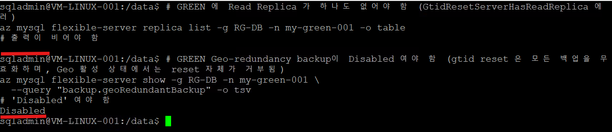

---

# Step 12. GTID reset 실행

> **목적**: GREEN 의 `gtid_purged` / `gtid_executed` 를 **`BLUE_GTID` 로 고정** 시켜, GREEN 이 "BLUE 의 해당 GTID 까지는 이미 적용됨" 을 인식하도록 만듭니다. 이후 replication 은 그 다음 트랜잭션부터 이어받아옵니다.  
> **실행 위치**: 💻VM → ☁️Azure

`az mysql flexible-server gtid reset` 이 수행하는 일:

- GREEN 의 `gtid_purged` 와 `gtid_executed` 를 모두 `--gtid-set` 으로 준 값 (= `BLUE_GTID`) 으로 **강제 설정** 함
- 의미: "이 GTID 까지의 트랜잭션은 이미 적용되었다" 고 GREEN 에게 알림 → Step 14 의 auto-position 이 그 **다음** GTID 부터 가져오게 됨
- 영향: **GREEN 의 기존 백업이 모두 무효화** 됨 (최근 백업으로 돌아갈 수 없음)

> 💡 이 명령이 PaaS 우회인 이유: 일반 MySQL 에서는 `RESET MASTER` + `SET GLOBAL gtid_purged=...` 로 직접 설정할 수 있지만, Azure Flex admin 은 그 권한이 없어 Azure CLI 를 통해서만 설정 가능합니다.

> ⚠️ `--server-name`/`-s` 가 반드시 **GREEN** 이어야 함. BLUE 에 실행하면 **운영 BLUE 의 GTID 좌표가 덮어쓰이고 기존 백업이 무효화** 되어 조치 불가.  
> ⚠️ 이 명령은 GREEN 의 모든 기존 백업을 무효화합니다.

```bash
az mysql flexible-server gtid reset \
  --resource-group <resource-group> \
  --server-name <green-name> \
  --gtid-set "<blue-gtid>" \
  --yes
```

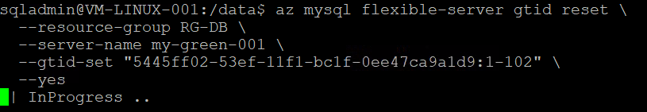

## 12.1 적용 확인

```sql
SELECT @@GLOBAL.gtid_purged;
-- BLUE_GTID 와 일치해야 함

SELECT @@GLOBAL.gtid_executed;
-- gtid_purged 와 동일한 값
```

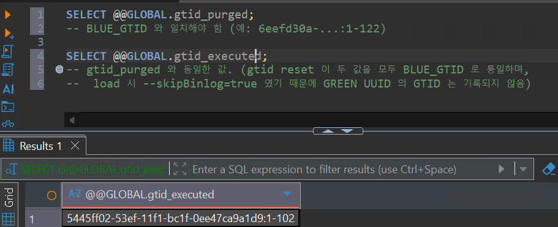

> 둘 다 `BLUE_GTID` 와 같으면 정상.
> 여기서 `BLUE_GTID` 는 **Step 8 에서 추출한 dump 시점의 BLUE `gtid_executed`** 입니다 (= dump 파일이 담고 있는 데이터의 좌표). 지금 이 시점의 BLUE 운영 `gtid_executed` 는 dump 이후에도 계속 증가하므로 그것과는 다릅니다.
> 의미: *"BLUE 의 `<blue-gtid>` 까지는 dump/load 로 이미 적용된 것으로 간주, replication 은 그 다음 트랜잭션부터 받아오겠다."*
>
> - `--skipBinlog=true` 를 사용한 경우: load 중 GREEN UUID 의 GTID 가 생성되지 않으므로 `gtid reset` 후 값이 자연스럽게 `BLUE_GTID` 와 일치
> - `--skipBinlog=true` 를 사용하지 않은 경우: load 중 GREEN UUID 의 GTID 가 생길 수 있으므로, `gtid reset` 이후 `gtid_purged` / `gtid_executed` 가 `BLUE_GTID` 로 통일되었는지를 반드시 검증

---

# Step 13. BLUE TLS root CA bundle 준비

> **목적**: GREEN 이 BLUE 에 SSL 로 접속해 binlog 를 가져올 때 서버 인증서를 검증할 **루트 CA bundle** 을 준비하고, fingerprint 검증 및 접속 테스트로 해당 bundle 이 BLUE 에 맞는지 확인합니다. Step 14 에서 이 PEM 내용이 `MASTER_SSL_CA` 로 주입됩니다.  
> **실행 위치**: 💻VM

왜 **bundle (DigiCert Global Root G2 + Microsoft RSA Root CA 2017)** 을 기본값으로 쓰는가:

- Azure Database for MySQL Flexible Server 는 현재 **dual-signed certificates** 를 제공하며, 신뢰 루트는 **DigiCert Global Root G2** 와 **Microsoft RSA Root CA 2017** 두 가지입니다 ([MS 공식 안내](https://learn.microsoft.com/en-us/azure/mysql/flexible-server/how-to-connect-tls-ssl)).
- 본 가이드는 Azure Database for MySQL Flexible Server 의 권장 방식에 따라 **DigiCert Global Root G2 + Microsoft RSA Root CA 2017** 을 결합한 CA bundle 사용을 기본값으로 합니다.
- **Azure CA rotation 시 서비스가 다른 루트로 서명될 수 있으므로**, 운영 절차는 **bundle (`/tmp/azure_mysql_ca_bundle.pem`) 기준으로 검증하고 수행** 합니다.
- Step 14 의 `mysql.az_replication_change_master_with_gtid` 는 마지막 인자로 **CA 의 PEM 텍스트 자체** 를 받으므로, bundle 파일 전체를 `cat` 해서 넘길 수 있습니다.

왜 **fingerprint 를 검증** 하는가:

- 다운로드 중 변조 / 사내 프록시가 중간에서 다른 인증서를 끼워 넣을 가능성 제거
- 공식 fingerprint 와 다르면 즉시 재다운로드

> 💡 Azure 가 향후 CA 체인을 교체하면 이 단계가 깨질 수 있습니다. 주기적으로 [MS 공식 문서](https://learn.microsoft.com/en-us/azure/mysql/flexible-server/how-to-connect-tls-ssl) 를 확인하세요.

## 13.1 root CA bundle 생성

```bash
# 1) DigiCert Global Root G2 PEM 다운로드
curl -fsSL https://cacerts.digicert.com/DigiCertGlobalRootG2.crt.pem \
  -o /tmp/dgrootg2.pem
sed -i 's/\r$//' /tmp/dgrootg2.pem

# 2) Microsoft RSA Root Certificate Authority 2017 PEM 다운로드
#    (URL 은 MS 공식 문서에서 확인 — 환경에 따라 경로가 달라질 수 있음)
curl -fsSL https://www.microsoft.com/pkiops/certs/Microsoft%20RSA%20Root%20Certificate%20Authority%202017.crt \
  -o /tmp/ms_rsa_root_2017.crt
openssl x509 -inform DER -in /tmp/ms_rsa_root_2017.crt \
  -out /tmp/ms_rsa_root_2017.pem
sed -i 's/\r$//' /tmp/ms_rsa_root_2017.pem

# 3) bundle 으로 결합
cat /tmp/dgrootg2.pem /tmp/ms_rsa_root_2017.pem > /tmp/azure_mysql_ca_bundle.pem

# 4) bundle 내 인증서 목록 확인 (DigiCert + Microsoft 2개 subject 가 나와야 함)
grep -c 'BEGIN CERTIFICATE' /tmp/azure_mysql_ca_bundle.pem    # 2 가 나와야 OK
openssl crl2pkcs7 -nocrl -certfile /tmp/azure_mysql_ca_bundle.pem \
  | openssl pkcs7 -print_certs -noout | grep -E 'subject|issuer'
```

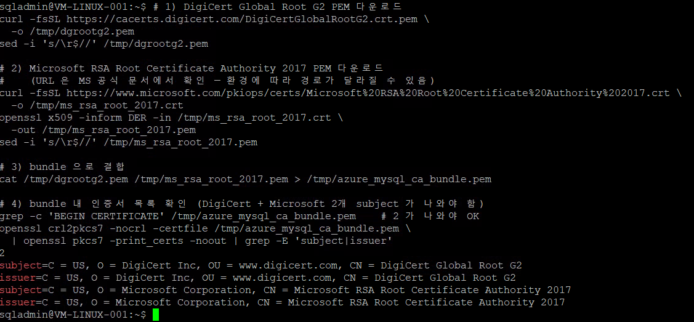

## 13.2 fingerprint 검증

```bash
# DigiCert Global Root G2 공식 fingerprint
openssl x509 -in /tmp/dgrootg2.pem -noout -fingerprint -sha256
# 기대값: CB:3C:CB:B7:60:31:E5:E0:13:8F:8D:D3:9A:23:F9:DE:47:FF:C3:5E:43:C1:14:4C:EA:27:D4:6A:5A:B1:CB:5F

# Microsoft RSA Root Certificate Authority 2017 공식 fingerprint
openssl x509 -in /tmp/ms_rsa_root_2017.pem -noout -fingerprint -sha256
# 기대값: C7:41:F7:0F:4B:2A:8D:88:BF:2E:71:C1:41:22:EF:53:EF:10:EB:A0:CF:A5:E6:4C:FA:20:F4:18:85:30:73:E0
# → fingerprint 는 MS 공식 문서에서 최신 값을 확인하세요 (CA rotation 이 있을 수 있음)
```

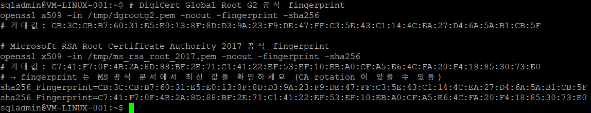

## 13.3 BLUE 서버를 bundle 로 검증

```bash
# Verify return code: 0 (ok) 이어야 함
echo Q | openssl s_client -starttls mysql \
  -connect <blue-fqdn>:3306 -CAfile /tmp/azure_mysql_ca_bundle.pem 2>/dev/null \
  | grep "Verify return code"
```

> 💡 **단일 PEM fallback (진단용)**: 운영 기본값은 항상 bundle (`/tmp/azure_mysql_ca_bundle.pem`) 입니다.
> 다만 bundle 검증이 실패하면, Step 13.1에서 준비한 각 PEM (`/tmp/dgrootg2.pem`, `/tmp/ms_rsa_root_2017.pem`)으로 `openssl s_client`를 개별 검증해 현재 BLUE 서버의 서명 루트를 식별할 수 있습니다.
> 원인 분석 후에는 다시 bundle 기준으로 운영 절차를 수행하세요.

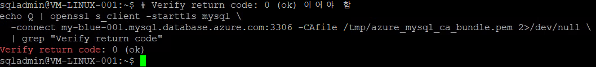

## 13.4 procedure 시그니처 확인 (옵션)

```sql
SELECT parameter_name, data_type, ordinal_position, parameter_mode
  FROM information_schema.parameters
 WHERE specific_schema='mysql'
   AND specific_name='az_replication_change_master_with_gtid'
 ORDER BY ordinal_position;
```

기대: 5번째 인자가 `MASTER_SSL_CA` (varchar). GTID 인자는 없음 (Step 12 의 `gtid reset` 이 사전 완료되어 있어야 함).

---

# Step 14. change master + start replication

> **목적**: GREEN 에 BLUE 를 source 로 지정하고 (`az_replication_change_master_with_gtid`) IO/SQL thread 를 시작 (`az_replication_start`) 합니다. 이 순간부터 GREEN 은 BLUE 의 binlog 를 끌어당겨 적용하기 시작합니다.  
> **실행 위치**: 💻VM → 🟩GREEN

왜 표준 `CHANGE REPLICATION SOURCE` 가 아니라 **`mysql.az_replication_*`** 일까:

- 표준 `CHANGE REPLICATION SOURCE TO ...` / `START REPLICA` 는 `SUPER` 또는 `REPLICATION_SLAVE_ADMIN` 권한이 필요 → Azure Flex admin 에게 없음
- Azure 는 `mysql.az_replication_*` stored procedure 묶음을 제공해서 PaaS 내부의 권한 있는 계정으로 호출되도록 wrap 함
- 따라서 본 가이드의 모든 replication 제어 (`change_master_with_gtid`, `start`, `stop` — Step 19, `remove_master` — Step 19) 가 이 wrapper 로만 가능
- `_with_gtid` 변형을 쓰는 이유: GTID auto-position 으로 좌표를 자동 계산 → Step 12 의 reset 이후 자연스럽게 그 다음 GTID 부터 가져옴 (`Auto_Position=1`)

> 💡 **내부 테이블 필터 확인**: Microsoft 공식 Data-out 문서는 replica 서버에 `Replicate_Wild_Ignore_Table = "mysql.__%"` 필터를 적용해 Azure 내부 테이블을 제외하도록 요구합니다. 본 환경 (BLUE/GREEN 모두 Azure Flex) 에서는 GREEN 의 `replicate_wild_ignore_table` 값이 `mysql.%,information_schema.%,performance_schema.%,sys.%` 로 이미 설정되어 있음을 확인했습니다 (공식 권장 `mysql.__%` 보다 넓은 패턴으로 동일 목적 충족). 단 이는 "Azure 가 항상 hard-set 하므로 작업 불필요" 가 아니라 **"현재 값이 적절한지 운영 전에 반드시 실제 적용값을 확인해야 한다** 의 의미입니다. Azure Portal → GREEN → **Server parameters** 또는 `SHOW VARIABLES LIKE 'replicate_wild_ignore_table'` 로 확인하고, 값이 비어 있거나 `mysql.__%` / `mysql.%` 계열 필터가 없으면 replication 시작 전에 설정하세요.

```bash
mysqlsh --uri <admin-user>@<green-fqdn>:3306 \
  --ssl-mode=REQUIRED --password='<password>' --sql <<EOF
SET @cert = '$(cat /tmp/azure_mysql_ca_bundle.pem)';

CALL mysql.az_replication_change_master_with_gtid(
  '<blue-fqdn>',
  'syncuser',
  '<password>',
  3306,
  @cert
);

CALL mysql.az_replication_start;

SHOW REPLICA STATUS\G
EOF
```

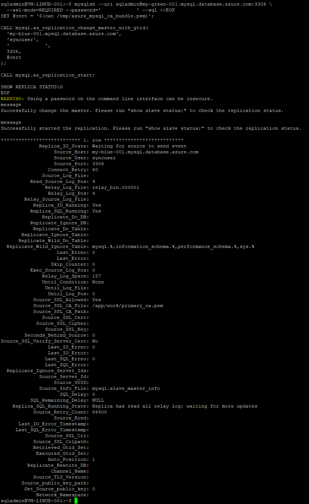

---

# Step 15. REPLICA STATUS 검증 + 동작 검증

> **목적**: Step 14 의 복제가 실제로 동작 중인지 확인합니다. (1) `SHOW REPLICA STATUS` 의 필수 필드, (2) BLUE 와 GREEN 의 `gtid_executed` 가 일치하는지 두 관점으로 검증합니다.  
> **실행 위치**: 🟩GREEN (+🟦BLUE)

## 15.1 상태 검증

`SHOW REPLICA STATUS\G` 출력에서:

| 필드 | 기대값 |
|---|---|
| `Replica_IO_Running` | **Yes** |
| `Replica_SQL_Running` | **Yes** |
| `Source_SSL_Allowed` | Yes |
| `Last_IO_Errno` / `Last_SQL_Errno` | 0 / 0 |
| `Source_UUID` | BLUE UUID |
| `Seconds_Behind_Source` | 0 |
| `Auto_Position` | 1 |

어긋난 필드가 있으면 → [트러블슈팅 빠른 참조](#트러블슈팅-빠른-참조)

## 15.2 GTID 일치 확인

🟦 [BLUE]
```sql
SELECT @@GLOBAL.gtid_executed AS blue_gtid;
```

🟩 [GREEN]
```sql
SELECT @@GLOBAL.gtid_executed AS green_gtid;
```

기대: GREEN 의 `gtid_executed` 가 BLUE 와 동일 (또는 차이가 매우 작고 곧 따라잡힘).
`Seconds_Behind_Source=0` 와 함께 일치하면 정상 동작.

> 💡 BLUE 에 신규 트랜잭션이 계속 들어오는 환경에서는 두 쿼리 실행 사이의 micro-gap 만큼 GREEN 이 뒤처져 보일 수 있습니다. 같은 쿼리를 2~3회 반복해 GREEN 이 BLUE 를 계속 따라가는지 (값이 함께 증가하는지) 확인하세요.

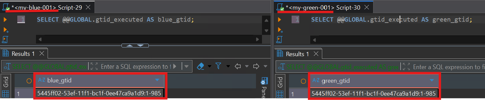

---

# Step 16. GREEN Read Replica 2개 생성

> **목적**: cutover 직후 읽기 분산을 바로 받을 수 있도록 GREEN 의 Read Replica 를 준비합니다. Replica 생성은 시간이 걸릴 수 있으므로, **BLUE → GREEN Data-in Replication 이 정상 동작하고 lag 가 안정화된 이후** 수행합니다.  
> **실행 위치**: 💻VM → ☁️Azure

## 실행 시점

- **GTID reset (Step 12) 전** 에는 **생성 불가** — GREEN 에 Read Replica 가 있으면 `gtid reset` 이 `GtidResetServerHasReadReplica` 로 거부됨
- **GTID reset + Data-in Replication 시작 (Step 14) 이후** 에는 본 환경에서 BLUE → GREEN → GREEN-Replica 까지 데이터 전파가 정상 동작함을 리허설로 검증함
- cutover 전/후 어느 시점에 생성하는가에 대한 공식 강제 순서는 문서상 없으며, 본 가이드는 cutover 직후 읽기 분산을 위해 **Step 15 안정화 직후** 생성하는 절차를 기본으로 삼음

> ⚠️ 이 시점의 GREEN 은 **두 가지 역할을 동시에** 가집니다 — (a) BLUE 의 Data-in Replication **target (replica)**, (b) GREEN 8.4 **primary** (Read Replica 를 소유). Data-in 문서는 (a) + (b) 조합을 별도로 명시 설명하지 않으므로, 본 절차는 **본 환경에서 리허설로 검증된 운영 절차** 로 기재합니다. 다른 subscription / region / SKU / HA 구성에 적용할 때는 동일 조건 리허설 환경에서 사전 검증 후 운영에 반영하세요.

이 시점의 구조는 다음과 같습니다:

```
BLUE 8.0 Primary
  └─ Data-in Replication (GTID)
      → GREEN 8.4 Primary
          ├─ GREEN 8.4 Read Replica #1
          └─ GREEN 8.4 Read Replica #2
```

- GREEN 이 BLUE 의 Data-in target 으로 동작하는 상태에서 GREEN Read Replica 를 생성하는 구성이며, Microsoft 공식 문서는 이 조합을 별도 토폴로지로 명시 설명하지는 않음
- cutover (Step 19) 에서 BLUE→GREEN 링크를 끊으면 GREEN 이 독립된 8.4 운영 primary + 2 read replica 구조로 자연스럽게 전환되며 추가 재구성 불필요

## 16.1 Replica 생성

Azure Portal → GREEN 서버 → **Replication** → **Add replica**:

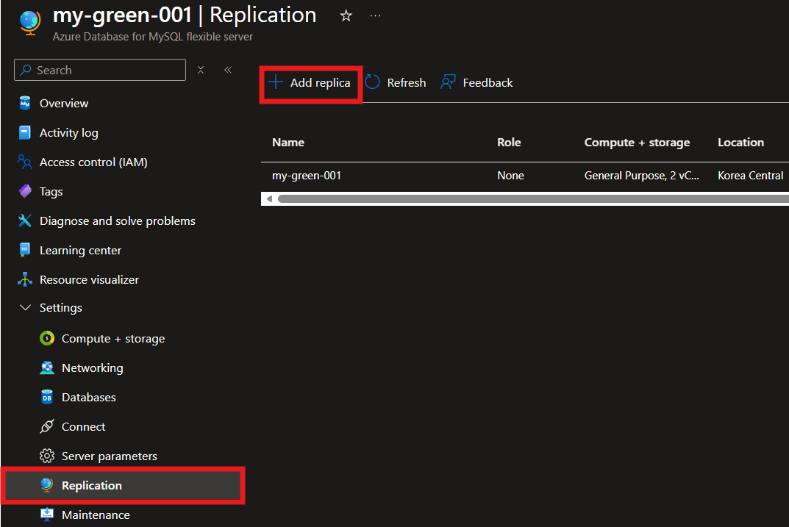

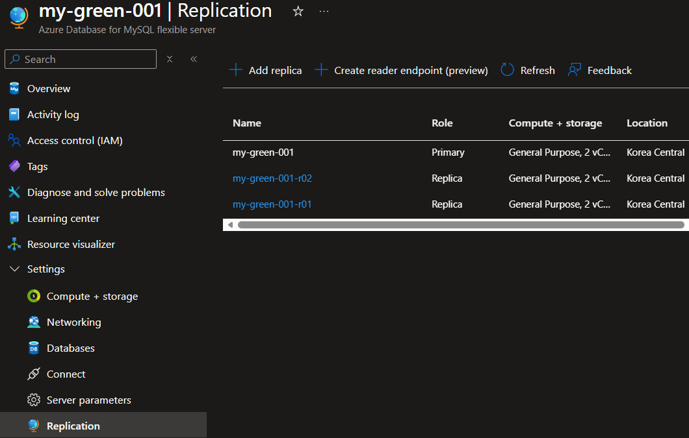

CLI 예시:
```bash
# Replica #1
az mysql flexible-server replica create \
  --resource-group <resource-group> \
  --replica-name <green-replica-1> \
  --source-server <green-name> \
  --location <same-or-paired-region>

# Replica #2
az mysql flexible-server replica create \
  --resource-group <resource-group> \
  --replica-name <green-replica-2> \
  --source-server <green-name> \
  --location <same-or-paired-region>

# 확인
az mysql flexible-server replica list -g <resource-group> -n <green-name> -o table
```

## 16.2 모니터링 — 두 채널의 관점 분리

이 시점의 토폴로지에는 두 가지 복제 채널이 공존하며, 각각 상태 확인 방법이 다릅니다. 한 쪽 지표만 보고 전체 상태를 판단하지 않도로록 나눠서 보세요.

### (A) BLUE → GREEN Data-in Replication 채널 — GREEN 에서 `SHOW REPLICA STATUS`

```sql
SHOW REPLICA STATUS\G
```

확인:
- `Replica_IO_Running` = Yes
- `Replica_SQL_Running` = Yes
- `Seconds_Behind_Source` = 0
- `Last_IO_Errno` = 0
- `Last_SQL_Errno` = 0

### (B) GREEN → GREEN Read Replica 채널 — Azure Monitor metric

Azure Database for MySQL Flexible Server 의 native Read Replica 는 Azure 가 관리하는 비동기 복제입니다. Microsoft 공식 문서에는 MySQL engine 의 native binlog file position-based replication 으로 설명되는 부분과, `SHOW REPLICA STATUS` 의 `Replica_IO_Running` 값을 상태 판단에 사용하지 말라는 monitoring 주의사항이 함께 존재합니다. 따라서 GREEN Read Replica 의 정상 여부는 `SHOW REPLICA STATUS` 의 `Replica_IO_Running` 값으로 판단하지 않고, Azure Portal → 해당 Read Replica → **Metrics** (또는 Azure Monitor) 의 다음 metric 으로 확인합니다:

- `Replica IO Status`
- `Replica SQL Status`
- `Replica Lag` (초 단위)

---

# Step 17. 정합성 검증

> **목적**: cutover 이전에 BLUE 와 GREEN 의 스키마 / row count / 내용 / 객체 개수가 일치하는지 확인해, 넘어간 다음 데이터 누락이 없는지 검증합니다.  
> **실행 위치**: 🟦BLUE + 🟩GREEN

BLUE 와 GREEN 양쪽에서 동일한 쿼리를 실행해 결과가 일치하는지 확인합니다. 권장 절차:

1. **스키마/테이블 목록 비교** — `information_schema.SCHEMATA` / `TABLES` 로 누락된 스키마·테이블이 없는지 확인
2. **테이블별 정확한 row count 비교** — 각 대상 테이블에 `SELECT COUNT(*)` 실행 후 BLUE/GREEN 결과를 매칭
3. **핵심 테이블 sample checksum** — 주요 테이블(주문, 사용자, 결제 등)에서 `MIN()/MAX()/COUNT()` + `SHA1(GROUP_CONCAT(... ORDER BY <pk>))` 또는 `CHECKSUM TABLE` 로 내용 일치 검증
4. **루틴/뷰/트리거/이벤트 개수** — `information_schema.ROUTINES` / `VIEWS` / `TRIGGERS` / `EVENTS` 개수가 일치하는지 확인

> ⚠️ `information_schema.TABLES.TABLE_ROWS` 는 InnoDB 통계 추정치라 실제 row 수와 다를 수 있습니다. **정확한 비교는 반드시 `SELECT COUNT(*)` 또는 checksum** 으로 수행.
>
> ⚠️ BLUE 에 실시간 트래픽이 흐르는 상황에서는 BLUE/GREEN 수치가 약간 다를 수 있습니다. 검증 전후로 `gtid_executed` 가 같은 값으로 안정되었는지 함께 확인하거나, 최종 검증은 Step 18 의 **write freeze 직후** 에 다시 한 번 수행하세요.

---

# Step 18. Cutover — write freeze

> **목적**: 앱 트래픽을 차단하고 BLUE 의 쓰기를 막아 **BLUE 와 GREEN 의 상태가 완전히 수렴하도록** 만듭니다. 이 순간부터 짧은 다운타임이 시작됩니다.  
> **실행 위치**: App / ☁️Azure

write freeze 가 필요한 이유: BLUE 가 계속 쓰기를 받는 동안은 GREEN 이 아무리 빠르게 따라가도 완전히 따라잡을 수가 없습니다. **BLUE 에 새 트랜잭션이 없는 시점** 을 만들어야 GREEN 이 "마지막 트랜잭션까지 적용 완료" 를 확인하고 (Step 19) 복제를 끊을 수 있으며, 이때서야 데이터 손실 없는 cutover 가 성립합니다.

앱 자체만 막아서는 부족한 이유: 다른 백엔드 / 배치 잡 / 외부 webhook / 관리 도구가 BLUE 에 여전히 쓸 수 있으므로, 아래의 (A) + (B) 를 함께 적용하는 것이 권장됩니다.

> ⚠️ Cutover 는 짧은 다운타임이 발생합니다.

1. 앱 트래픽 차단 (LB / Front Door / maintenance mode)
2. 🟦 [BLUE] **쓰기 중단** — Azure Flex 에서는 `super_read_only` 가 8.0 / 8.4 모두 **변경 불가**. 다음 중 하나:

   **(A) 권장**: 앱/배치 단에서 BLUE 로의 쓰기 전면 중단 (connection string 차단, 배치 잡 일시정지)

   **(B) 보조**: ☁️ [Azure] BLUE 의 `read_only` 파라미터 `ON` 으로 변경
   ```bash
   az mysql flexible-server parameter set \
     -g <resource-group> -s <blue-name> \
     --name read_only --value ON
   ```

  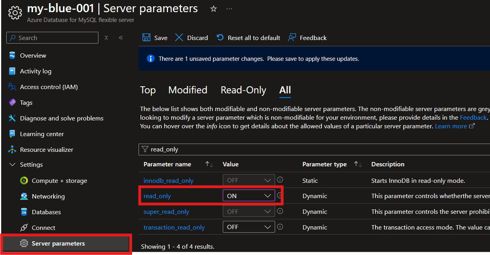

   > `read_only=ON` 은 `SUPER` / `CONNECTION_ADMIN` 권한이 없는 모든 계정의 쓰기를 차단해 BLUE 의 일반 사용자 DML 을 정지시키기 위한 조치입니다.
   > Azure Flex 에서 이 권한은 `azure_superuser` (PaaS 내부 계정) 만 보유 → 사용자가 생성한 관리자도 차단됩니다.
   > 이 설정은 이미 기록된 BLUE binlog 를 GREEN 이 `syncuser` (REPLICATION SLAVE 권한) 로 읽어가는 동작을 막기 위한 것이 아니므로, write freeze 이후에도 GREEN 은 BLUE 의 남은 binlog 를 계속 적용해 lag=0 까지 따라잡을 수 있습니다.
   >
   > 권한 보유 계정 점검:
   > ```sql
   > SELECT GRANTEE, PRIVILEGE_TYPE, IS_GRANTABLE
   >   FROM INFORMATION_SCHEMA.USER_PRIVILEGES
   >  WHERE PRIVILEGE_TYPE IN ('SUPER','CONNECTION_ADMIN')
   >  ORDER BY GRANTEE, PRIVILEGE_TYPE;
   > ```

GREEN 에 이미 write 가 누적된 이후의 롤백 옵션 (A)(B)(C) 와 8.4 → 8.0 reverse replication 비채택 이유 → [롤백 옵션](#롤백-옵션)

---

# Step 19. Cutover — lag=0 확인 + 복제 끊기

> **목적**: GREEN 이 BLUE 의 마지막 트랜잭션까지 완전히 따라잡은 것을 확인한 후 BLUE→GREEN 복제 링크를 끊어 GREEN 을 **8.4 신규 운영 primary** (BLUE 를 대체하는 서비스 primary) 로 전환합니다.  
> **실행 위치**: 🟩GREEN

## 19.1 GREEN 이 BLUE 의 끝까지 따라잡았는지 확인

```sql
SHOW REPLICA STATUS\G
-- Replica_IO_Running=Yes, Replica_SQL_Running=Yes,
-- Seconds_Behind_Source=0, Last_IO_Errno=0, Last_SQL_Errno=0
```

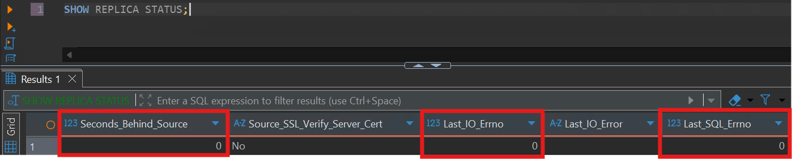

## 19.2 BLUE→GREEN 복제 끊기

```sql
CALL mysql.az_replication_stop;
```
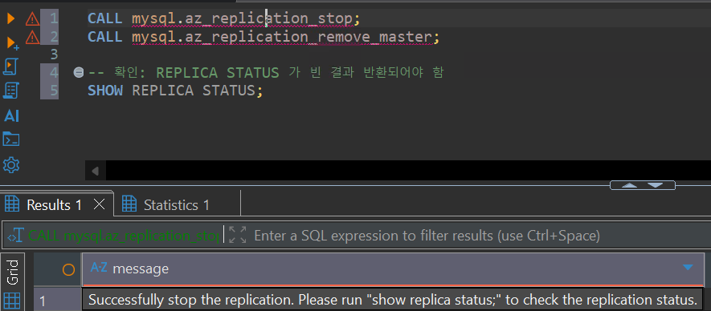

```sql
CALL mysql.az_replication_remove_master;
```
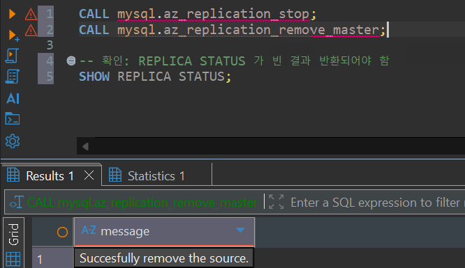

## 19.3 검증

```sql
SHOW REPLICA STATUS\G
-- 빈 결과(Empty set) 가 반환되어야 함
```

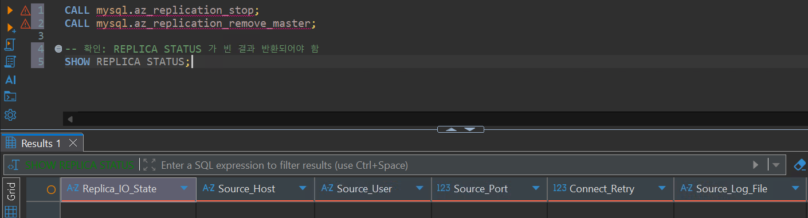

> `az_replication_stop` 은 IO/SQL thread 정지, `az_replication_remove_master` 는 master 설정 제거.
> **둘 다 수행해야** GREEN 이 BLUE 에 의존하지 않는 8.4 신규 운영 primary 가 됩니다.

> 🧩 **예외 — cutover 전후로 GREEN 에 트랜잭션 누락이 의심될 때**: 누락 *여부* 는 Step 17 정합성 검증으로 판정하되, **무엇이 누락됐는지(어떤 row 가 어떤 값으로 변경됐는지)** 를 BLUE binlog 에서 엔진 레벨로 추적하려면 → [docs/binlog_tracking.md](docs/binlog_tracking.md)

---

# Step 20. Application 전환 + 사후 정리

> **목적**: 로드 때 꺼둔 GREEN 의 `event_scheduler` / EVENT 상태를 복구하고, 앱의 connection 대상을 GREEN 으로 넘긴 뒤 스모크 테스트 / 관찰 / BLUE 폐기 계획을 진행합니다.  
> **실행 위치**: App / ☁️Azure

1. ☁️ [Azure] GREEN `event_scheduler=ON` 변경 (로드 중 OFF 였던 것 복구):
   ```bash
   az mysql flexible-server parameter set \
     -g <resource-group> -s <green-name> \
     --name event_scheduler --value ON
   ```
2. 🟩 [GREEN] EVENT 재활성화 — dump 시 `SLAVESIDE_DISABLED` 로 들어왔을 수 있음:
   ```sql
   -- 비활성 상태인 이벤트 목록 확인
   SELECT EVENT_SCHEMA, EVENT_NAME, STATUS
     FROM information_schema.EVENTS
    WHERE STATUS <> 'ENABLED';

   -- 각 이벤트를 ENABLE 처리 (스키마/이벤트명은 본인 환경 값으로)
   ALTER EVENT <schema-name>.<event-name> ENABLE;
   ```
3. 앱 connection string 을 GREEN FQDN 으로 전환 (또는 Private DNS CNAME 스왑)
4. 앱 maintenance mode OFF, 트래픽 재개
5. 스모크 테스트 (로그인 / 주문 / 결제 등 핵심 경로)
6. BLUE 모니터링 후 폐기 결정 (일정 기간 보관 권장)

## cutover 완료 상태

```
[BLUE]   read-only → 운영 중단 예정
   │
   ✖   (Step 19 에서 끊음)
   │
[GREEN]  new primary ← 앱 전체 트래픽
   ├─→ [GREEN-Replica-1]
   └─→ [GREEN-Replica-2]
```

---

## 롤백 옵션

> ⛔ **`GREEN 8.4 → BLUE 8.0` 방향의 reverse replication 은 본 가이드의 표준 rollback 절차로 채택하지 않습니다.**
> MySQL 공식 replication upgrade topology 문서는 지원되는 upgrade path 에서 **older source → newer replica role** 방향은 지원하지만, **later release source → earlier release replica role** 방향은 지원하지 않는다고 명시합니다.
> 본 가이드의 BLUE / GREEN 은 Azure 리소스 관점에서는 각각 독립된 Flexible Server Primary 입니다. 다만 replication channel 관점에서는 binlog/GTID 를 제공하는 서버가 **source**, 이를 받아 적용하는 서버가 **target 또는 replica role** 입니다.
> 현재 마이그레이션은 `BLUE 8.0 → GREEN 8.4` 방향이므로 BLUE 가 source, GREEN 이 target role 입니다. cutover 후 rollback 을 위해 방향을 `GREEN 8.4 → BLUE 8.0` 으로 뒤집으면 GREEN 이 source, BLUE 가 target role 이 되며, 이는 MySQL 공식 문서상 지원되지 않는 **newer source → older target** 방향입니다.
> 따라서 cutover 후 GREEN 에 write 가 발생한 상태에서 BLUE 로 되돌리는 reverse replication 은 표준 rollback 으로 사용하지 않습니다.

### cutover 직후 (수 분 이내, GREEN 에 새 write 거의 없음)

DNS / connection string 을 BLUE 로 원복 → BLUE `read_only=OFF` 로 되돌리면 됩니다. 가장 안전한 롤백 path.

### cutover 후 (분 이상 경과, GREEN 에 이미 write 누적)

다음 중 하나로 rollback 범위를 한정합니다:

| 옵션 | 내용 |
|---|---|
| **(A) write 차단 유지 후 BLUE 원복** | cutover 검증 기간 동안 GREEN 에 새 write 가 생기지 않도록 앱/배치를 계속 막은 상태로 진행. 문제 발견 시 DNS/connection string 만 BLUE 로 다시 돌리고 BLUE `read_only=OFF` |
| **(B) GREEN 변경분 유실 수용** | GREEN 에 이미 들어간 write 를 비즈니스가 손실로 승인 후 BLUE 로 cutback. 단순하지만 데이터 손실 발생 |
| **(C) 별도 보정 절차 사전 검증** | dual-write, 별도 CDC 도구, 논리 보정 스크립트 등을 **cutover 전에 동일 SKU/HA/region 에서 검증** 해 두고 사용 |

> ⚠️ `az_replication_change_master_with_gtid` 로 BLUE 를 GREEN 의 replica 로 잡는 구성 자체는 명령이 떨어질 수 있지만, 위 supportability 제약 때문에 운영 rollback path 로 채택하지 마세요. 어떤 형태로든 8.4 → 8.0 데이터 흐름이 필요하면 위 **(C) 의 사전 검증 절차** 로만 진행합니다.

---

## 관련 문서

| 문서 | 내용 |
|---|---|
| [docs/parameter_compatibility.md](docs/parameter_compatibility.md) | 17개 파라미터 통과 조건 / 의미 / 미통과 대응, BLUE↔GREEN diff 스크립트 |
| [docs/azure_flex_allowlist.md](docs/azure_flex_allowlist.md) | Upgrade Checker 노이즈 (무조건 무시 / 조건부 무시 / Error) 분류 |
| [docs/authentication_plugins.md](docs/authentication_plugins.md) | `mysql_native_password` vs `caching_sha2_password`, 8.4 `authentication_policy`, `--includeUsers` 동작 |
| [docs/definer_handling.md](docs/definer_handling.md) | DEFINER 판정 표, ERROR 1449, DROP+CREATE 레시피 |
| [docs/binlog_tracking.md](docs/binlog_tracking.md) | (예외) 누락 의심 시 `mysqlbinlog` 로 BLUE binlog 를 디코딩해 누락 트랜잭션을 row 단위로 추적 |
| [docs/seed_via_replica_promotion.md](docs/seed_via_replica_promotion.md) | (대안) dump/load 대신 BLUE Read Replica 를 8.4 업그레이드 · promote 해 GREEN 을 시딩하는 경로 |

---

## 트러블슈팅 빠른 참조

| 증상 | 원인 | 해결 |
|---|---|---|
| `Access denied` on `loadDump` 끝 | admin 의 SUPER 부재 | `--updateGtidSet=off` 사용 |
| dump 로그 `0 users will be dumped` | `--includeUsers` placeholder 미치환 | 실제 계정명으로 변경 후 재실행 |
| `mysqlsh-sql>` 프롬프트에서 무한 대기 | multi-line 명령 끼임 (`\` 누락) | `\q;` → `\q` 한 번 더 |
| `GtidResetServerHasReadReplica` | GREEN 에 read replica 존재 | 모두 삭제 후 reset → CDC 안정화 후 재생성 |
| `geoRedundantBackup=Enabled` 로 reset 거부 | Geo 활성 | Disabled 로 변경 후 reset (ZoneRedundant HA 면 사후 토글 불가 → 신규 서버 재생성) |
| `ERROR 1236 ... binary log is not available` | BLUE binlog purge | `binlog_expire_logs_seconds` 늘리고 dump+load 재실행 |
| `Replica_IO_Running=No`, `SSL connection error` | CA 불일치 또는 chain 부조 | 1) Step 13.3 bundle (`/tmp/azure_mysql_ca_bundle.pem`) 으로 `openssl s_client` 검증 재수행. 2) bundle 으로 실패시 Step 13.1 의 각 PEM (`dgrootg2.pem`, `ms_rsa_root_2017.pem`) 를 개별로 검증해 현재 BLUE 서버가 서명된 루트를 특정 → Step 14 `@cert` 에 해당 PEM 주입 |
| `Replica_IO_Running=Connecting` 으로 멈춤 | 네트워크 / 방화벽 / sync 계정 권한 | BLUE Networking 의 firewall 에 GREEN outbound IP 확인, `syncuser` 의 `ssl_type` 및 `REPLICATION SLAVE` 권한 확인 |
| `Replica_SQL_Running=No`, `Last_SQL_Errno=1062` (duplicate key) | dump 시점 이후 BLUE 변경이 load 에 일부 포함되어 GTID 어긋남 | dump → load → gtid reset → start replication 을 일관된 시점으로 재실행 |
| 정합성 검증에서 GREEN 에 row 누락 의심 (무엇이 빠졌는지 추적 필요) | cutover 전후 일부 트랜잭션 미적용 | BLUE binlog 를 `mysqlbinlog` 로 디코딩해 누락 트랜잭션 추적 → [docs/binlog_tracking.md](docs/binlog_tracking.md) |
| `ERROR 1449: definer does not exist` | DEFINER 재정의 누락 | [docs/definer_handling.md](docs/definer_handling.md) |
| `the following arguments are required: --server-name/-s` | `gtid reset` 만 `-s` (다른 명령은 `-n`) | `-s` 로 변경 |
| cutover 후 EVENT 가 실행되지 않음 | dump 시 `SLAVESIDE_DISABLED` 또는 `event_scheduler=OFF` | Step 20 의 `event_scheduler=ON` + `ALTER EVENT ... ENABLE` 재확인 |

---

## 참고 링크

- [MS Docs: Data-in Replication 개념](https://learn.microsoft.com/en-us/azure/mysql/flexible-server/concepts-data-in-replication)
- [MS Docs: Configure Data-in Replication](https://learn.microsoft.com/en-us/azure/mysql/flexible-server/how-to-data-in-replication?tabs=bash%2Ccommand-line)
- [MySQL Shell: Upgrade Checker Utility](https://dev.mysql.com/doc/mysql-shell/9.7/en/mysql-shell-utilities-upgrade.html)
- [MySQL Shell: Instance Dump Utility](https://dev.mysql.com/doc/mysql-shell/9.7/en/mysql-shell-utilities-dump-instance-schema.html)
- [MySQL Shell: Dump Loading Utility](https://dev.mysql.com/doc/mysql-shell/9.7/en/mysql-shell-utilities-load-dump.html)
