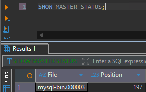
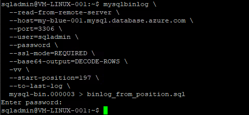
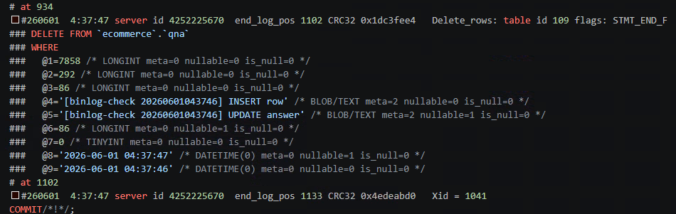

# binlog 기반 누락 트랜잭션 추적 가이드

> [README.md](../README.md) Step 19 (cutover — lag=0 확인 + 복제 끊기) 의 **예외 상황** 참조 문서.
> cutover 전후로 GREEN 에 일부 트랜잭션이 누락된 정황이 의심될 때, **BLUE 의 binary log 를 DB 엔진 레벨에서 직접 디코딩** 해서
> 어떤 row 가 어떤 값으로 변경됐는지를 row 단위로 **추적** 하는 방법을 정리합니다.

---

## 1. 언제 사용하나

GREEN 에 일부 트랜잭션이 누락된 것으로 의심되거나 이미 확인된 상황에서, **BLUE 가 binlog 에 기록한 변경 트랜잭션의 실제 내용** (어떤 row 가 어떤 값으로 INSERT/UPDATE/DELETE 됐는지) 을 엔진 레벨에서 직접 꺼내 추적합니다.

- GREEN 의 SQL thread 가 멈췄을 때 (`Last_SQL_Errno != 0`)
- `Seconds_Behind_Source` 가 0 인데도 정합성 검증 (Step 17) 에서 row 차이가 날 때

> 누락 *여부* 판정 (row count / checksum 비교) 은 Step 17 정합성 검증과 [README.md](../README.md) 트러블슈팅 표를 따르고, 이 문서는 누락된 **내용 추적** 에 집중합니다.

---

## 2. 전제 조건

| 항목 | 요구 | 확인 |
|---|---|---|
| BLUE binlog 보존 | 추적 대상 구간이 아직 purge 되지 않아야 함 | `binlog_expire_logs_seconds` (Step 2). 이미 purge 됐으면 `ERROR 1236` → 추적 불가 |
| binlog 포맷 | `ROW` (row 이벤트가 있어야 값 디코딩 가능) | BLUE `binlog_format=ROW`. 추적 정확도를 높이려면 `binlog_row_image=FULL` 권장 — 기본값 `minimal` 에서도 추적은 가능하나 UPDATE/DELETE 의 before-image 가 식별 키(PK)로 제한됨 → 상세 §3.4 (Step 2 / parameter_compatibility) |
| 접속 계정 | binlog 원격 읽기 권한 | Step 4 에서 만든 `syncuser` (`REPLICATION SLAVE`) 재사용 가능. 또는 `REPLICATION SLAVE` 보유 계정 |
| 실행 위치 | 점프박스(💻VM) 에서 BLUE 로 원격 | `mysqlbinlog` 가 `mysql-client` 에 포함 (Step 1 설치) |
| TLS | BLUE 는 `REQUIRED` | `--ssl-mode=REQUIRED` |

> 본문 코드의 `<blue-fqdn>`, `<sync-user>`, `<binlog_file>`, `<position>` 등은 **placeholder** 입니다. 본인 환경 값으로 치환하세요.
> 첨부 캡처는 작성 당시 실제 값이 노출되어 있으니 형식·위치 참고용으로만 보세요.

---

## 3. 추적 절차

### 3.1 추적 시작점(File / Position) 확보

🟦 [BLUE] 에서 현재 binlog 파일명과 position 을 확인합니다.

```sql
SHOW MASTER STATUS;
-- File, Position 확인
-- ex) mysql-bin.000002    148193
```



추적 시작점은 다음 중 상황에 맞는 것을 기준으로 잡습니다.

- **GREEN 이 마지막으로 적용한 지점 이후** 를 보고 싶을 때 → GREEN 의 `gtid_executed` 마지막 GTID 의 trx 직후, 또는 cutover 직전 `SHOW MASTER STATUS` 로 기록해 둔 position
- **특정 시각 이후** 를 보고 싶을 때 → 3.2 의 `--start-datetime` 사용

### 3.2 mysqlbinlog 로 구간 디코딩

💻 [VM] 점프박스에서 BLUE 로 원격 접속해 binlog 를 디코딩합니다.

**(A) 특정 position 부터**

```bash
mysqlbinlog \
  --read-from-remote-server \
  --host=<blue-fqdn> \
  --port=3306 \
  --user=<sync-user> \
  --password \
  --ssl-mode=REQUIRED \
  --base64-output=DECODE-ROWS \
  -vv \
  --start-position=<position> \
  --to-last-log \
  <binlog_file> > binlog_from_position.sql
```

**(B) 특정 시간부터 (cutover 시각 기준 등)**

```bash
mysqlbinlog \
  --read-from-remote-server \
  --host=<blue-fqdn> \
  --port=3306 \
  --user=<sync-user> \
  --password \
  --ssl-mode=REQUIRED \
  --base64-output=DECODE-ROWS \
  -vv \
  --start-datetime="2026-05-27 02:14:00" \
  --to-last-log \
  <binlog_file> > binlog_from_time.sql
```



> 추적 구간의 끝을 한정하려면 `--stop-position=<pos>` 또는 `--stop-datetime="..."` 을 함께 줍니다.
> 시작점이 어느 binlog 파일인지 모르면 BLUE 에서 `SHOW BINARY LOGS;` 로 파일 목록을 먼저 확인하세요.

### 3.3 디코딩 결과 해석 — row 단위 추적

`--base64-output=DECODE-ROWS -vv` 를 주면 row 이벤트가 사람이 읽을 수 있는 **pseudo-SQL 주석(`### ...`)** 으로 풀립니다. 아래는 실제 출력 예시입니다.

```text
SET @@SESSION.GTID_NEXT= '939759fb-58b9-11f1-b64f-62709d1a4c6b:470'/*!*/;
...
#260527  2:12:35 server id 4252225670 ... Table_map: `ecommerce`.`qna` mapped to number 106
#260527  2:12:35 server id 4252225670 ... Write_rows: table id 106 flags: STMT_END_F
### INSERT INTO `ecommerce`.`qna`
### SET
###   @1=625 /* LONGINT meta=0 nullable=0 is_null=0 */
###   @2=220 /* LONGINT meta=0 nullable=0 is_null=0 */
###   @3=94 /* LONGINT meta=0 nullable=0 is_null=0 */
###   @4='[replication-check #375] inserted at 2026-05-27 02:12:35' /* BLOB/TEXT meta=2 ... */
###   @5=NULL ...
###   @9='2026-05-27 02:12:35' /* DATETIME(0) ... */
COMMIT/*!*/;
```



읽는 법:

| 출력 요소 | 의미 |
|---|---|
| `GTID_NEXT= '<uuid>:<n>'` | 이 트랜잭션의 **GTID**. GREEN 반영 여부 판단의 기준 키 (4장) |
| `SET TIMESTAMP=<epoch>` / `#YYMMDD H:M:S` | 트랜잭션 커밋 시각 (UTC) — 시간 기준 추적에 사용 |
| `Table_map: \`db\`.\`tbl\`` | 뒤따르는 row 이벤트가 어떤 테이블에 대한 것인지 |
| `Write_rows` | **INSERT** |
| `Update_rows` | **UPDATE** — `@N=...` 가 **변경 전(WHERE)** 과 **변경 후(SET)** 두 블록으로 나옴 |
| `Delete_rows` | **DELETE** — `@N=...` 는 삭제된 row 의 값(WHERE) |
| `@1, @2, ...` | 테이블의 **컬럼 순서(ordinal)**. 컬럼명이 아니라 위치이므로 대상 테이블 DDL 과 매핑해서 해석 |
| 주석의 `LONGINT/BLOB/TEXT/DATETIME ...` | 컬럼 타입·nullable·null 여부 메타 |

> `@N` 은 컬럼 **이름이 아니라 순번** 입니다. 어떤 컬럼인지 확정하려면 BLUE/GREEN 에서
> `SELECT ORDINAL_POSITION, COLUMN_NAME FROM information_schema.COLUMNS WHERE TABLE_SCHEMA='<db>' AND TABLE_NAME='<tbl>' ORDER BY ORDINAL_POSITION;`
> 로 순번↔컬럼명 매핑표를 떠 놓고 보면 정확합니다.

### 3.4 `binlog_row_image` 에 따라 디코딩에 보이는 값이 달라짐

row 이벤트는 변경 **전(before-image, BI)** / **후(after-image, AI)** 두 이미지를 담는데, `binlog_row_image` 가 이 BI/AI 에 **어떤 컬럼을 기록할지** 를 결정합니다. 즉 같은 트랜잭션이라도 BLUE 의 `binlog_row_image` 설정에 따라 §3.3 디코딩 출력에서 **볼 수 있는 컬럼이 달라집니다.**

이벤트별로 사용하는 이미지 자체가 다릅니다:

| 이벤트 | 기록 이미지 | `FULL` 일 때 | `minimal` 일 때 |
|---|---|---|---|
| **INSERT** (`Write_rows`) | AI 만 | 전체 컬럼 | **전체 컬럼** (새 행이라 양쪽 동일) |
| **UPDATE** (`Update_rows`) | BI + AI | BI=전체, AI=전체 | **BI=식별 키(PK)만**, **AI=변경된 컬럼만** |
| **DELETE** (`Delete_rows`) | BI 만 | 전체 컬럼 | **식별 키(PK)만** |

추적 관점에서의 의미:

- **INSERT** 는 `minimal` 이어도 전체 컬럼이 남으므로 어떤 값이 들어갔는지 완전히 추적 가능 (값 손실 없음).
- **UPDATE** 는 `minimal` 이면 **변경된 컬럼의 "이전 값" 을 알 수 없습니다.** BI 에 PK 만 남고, 바뀐 컬럼은 AI(새 값)로만 보이기 때문입니다. `FULL` 이면 모든 컬럼의 변경 전·후 값이 다 보입니다.
- **DELETE** 는 `minimal` 이면 **삭제된 행의 PK 만** 남아 "무엇이 지워졌는지" 는 알아도 **삭제된 행의 전체 내용은 복원할 수 없습니다.** `FULL` 이면 삭제 직전 행 전체가 보입니다.
- 예외: **PK·NOT NULL UNIQUE 키가 전혀 없는 테이블** 은 `minimal` 이라도 행을 식별할 수단이 없어 MySQL 이 BI 에 전체 컬럼을 기록합니다 (→ [parameter_compatibility.md §2.6](parameter_compatibility.md)).

같은 UPDATE 트랜잭션을 두 설정으로 디코딩하면 출력이 이렇게 갈립니다 (컬럼 5개 중 `@4` 만 변경했다고 가정):

```text
# binlog_row_image = minimal
### UPDATE `ecommerce`.`qna`
### WHERE
###   @1=625                       /* PK 만 (행 식별용) */
### SET
###   @4='수정된 내용'            /* 변경된 컬럼만, 새 값만 */

# binlog_row_image = FULL
### UPDATE `ecommerce`.`qna`
### WHERE
###   @1=625                       /* 전체 컬럼 = 변경 전 값 */
###   @2=220
###   @3=94
###   @4='원래 내용'              /* 변경 전 값까지 보임 */
###   @5='2026-05-27 02:00:00'
### SET
###   @1=625                       /* 전체 컬럼 = 변경 후 값 */
###   @2=220
###   @3=94
###   @4='수정된 내용'
###   @5='2026-05-27 02:00:00'
```

> 정리: **누락 *여부* 판정(어떤 GTID 가 빠졌는가)은 `minimal` 로도 충분**합니다 (GTID 는 이미지와 무관). 하지만 **누락된 UPDATE 의 이전 값 / DELETE 된 행의 전체 내용까지 복원·감사** 하려면 BLUE 가 `FULL` 이어야 합니다. 이미 발생한 구간을 소급 추적할 때는 그 시점 BLUE 의 `binlog_row_image` 설정이 무엇이었는지가 추적 가능 범위를 결정합니다 (사후에 `FULL` 로 바꿔도 과거 binlog 에는 소급 적용되지 않음).

> 📎 **실측 샘플**: 동일한 INSERT→UPDATE→DELETE 시퀀스를 두 설정으로 실제 디코딩한 결과 — [samples/binlog_FULL.sql](samples/binlog_FULL.sql) / [samples/binlog_MINIMAL.sql](samples/binlog_MINIMAL.sql) (server-id·GTID UUID·DB명은 placeholder 로 sanitize). MINIMAL 쪽 UPDATE 의 `WHERE` 에 PK 만, DELETE 의 `WHERE` 에 PK 만 남는 것을 직접 비교할 수 있습니다.

---

## 4. 추적한 트랜잭션을 GREEN 과 대조

디코딩으로 얻은 각 트랜잭션의 GTID 가 GREEN 에 적용됐는지 확인합니다.

🟩 [GREEN] 에서:

```sql
-- GREEN 이 실행 완료한 전체 GTID 집합
SELECT @@GLOBAL.gtid_executed;

-- 특정 GTID 가 GREEN 에 이미 포함됐는지 (1=포함, 0=누락)
SELECT GTID_SUBSET(
  '939759fb-58b9-11f1-b64f-62709d1a4c6b:470',
  @@GLOBAL.gtid_executed
) AS applied;
```

- `applied=1` → 그 트랜잭션은 GREEN 에 이미 반영됨 (누락 아님)
- `applied=0` → GREEN 에 **누락된 트랜잭션**. 3.3 의 디코딩 내용이 곧 "빠진 변경의 실제 값"

---

## 5. 누락분을 다룰 때 주의

추적으로 "무엇이 빠졌는지" 를 확보한 뒤, 실제 보정은 신중히 진행합니다.

- **그대로 replay 금지(원칙)** — 디코딩된 `### INSERT/UPDATE/DELETE` 주석은 그대로 실행 가능한 SQL 이 아니라 **추적용 표현** 입니다. GREEN 에 같은 GTID 를 다시 적용하면 GTID 충돌·중복키(`1062`) 가 발생할 수 있습니다.
- **근본 해결 우선** — 누락이 dump/load 시점 불일치 때문이면, [README.md](../README.md) 트러블슈팅의 *"dump → load → gtid reset → start replication 일관된 시점 재실행"* 이 정석입니다. binlog 추적은 그 전에 **무엇이/얼마나 빠졌는지 파악하는 근거 확보** 용도로 씁니다.
- **부득이한 수동 보정 시** — 추적된 row 값을 근거로, 멱등성(존재 시 무시/`INSERT ... ON DUPLICATE KEY`)과 PK 충돌을 고려한 별도 보정 스크립트를 만들고, cutover 전 동일 SKU/region 에서 검증 후 적용 (롤백 옵션 (C) 와 동일 원칙).

---

## 6. 주요 옵션 참조

| 옵션 | 의미 |
|---|---|
| `--read-from-remote-server` | 로컬 파일이 아니라 원격 서버(BLUE)의 binlog 를 직접 읽음 (Azure Flex 는 파일 직접 접근 불가) |
| `--host/--port/--user/--password` | BLUE 접속 정보. `--password` 만 주면 프롬프트로 입력 |
| `--ssl-mode=REQUIRED` | BLUE 는 TLS 필수 |
| `--base64-output=DECODE-ROWS` | base64 row 이벤트를 디코딩해 사람이 읽을 수 있게 |
| `-vv` | 컬럼 값·타입 메타까지 상세 주석 출력 (값 추적에 필수) |
| `--start-position=<pos>` | 해당 position 부터 |
| `--start-datetime="..."` / `--stop-datetime="..."` | 시간 구간 한정 |
| `--stop-position=<pos>` | 종료 position 한정 |
| `--to-last-log` | 시작 파일부터 마지막 binlog 까지 이어서 |

---

## 참고 링크

- [MySQL: mysqlbinlog — Utility for Processing Binary Log Files](https://dev.mysql.com/doc/refman/8.0/en/mysqlbinlog.html)
- [MySQL: mysqlbinlog Row Event Display](https://dev.mysql.com/doc/refman/8.0/en/mysqlbinlog-row-events.html)
- [MS Docs: Data-out Replication (source-side 제약)](https://learn.microsoft.com/en-us/azure/mysql/flexible-server/how-to-data-out-replication?tabs=command-line)
